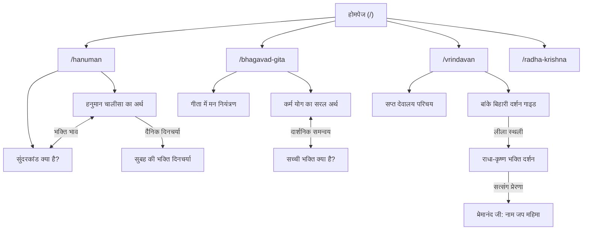

# BhaktiMania Content Strategy & Editorial Roadmap
> **संस्करण:** 1.0 (प्रारंभिक संपादकीय रूपरेखा)  
> **कार्यकारी एजेंट:** `bhaktimania-content` (Content & Editorial Agent)  
> **स्थिति:** अनुमोदित योजना (Planning & Strategy Document)  
> **लक्ष्य:** भक्तिमेनिया को एक प्रामाणिक, विश्वसनीय, शाश्वत और मर्यादापूर्ण हिंदी सनातन-आध्यात्मिक ज्ञान मंच के रूप में स्थापित करना।

---

## 1. मौजूदा 10 लेखों का संपादकीय ऑडिट (Audit of Existing Articles)

वेबसाइट के मौजूदा डेटासेट (`lib/data/articles.ts`) में उपलब्ध 10 आलेखों का विस्तृत तकनीकी एवं संपादकीय मूल्यांकन:

| # | आलेख शीर्षक | श्रेणी (Slug) | मुख्य पाठक प्रश्न (Reader Query) | खोज उद्देश्य (Search Intent) | विषय गहराई (Content Depth) | संभावित दोहराव (Overlap Analysis) | आंतरिक लिंक अवसर (Internal Link Opportunities) |
|---|---|---|---|---|---|---|---|
| 1 | **सच्ची भक्ति क्या है? दैनिक जीवन में भक्ति का महत्व** (`sacchi-bhakti-kya-hai`) | भक्ति विचार (`bhakti-vichar`) | "सच्ची भक्ति का वास्तविक अर्थ क्या है? क्या केवल पूजा-पाठ ही भक्ति है?" | Informational / Spiritual reflection | **गहरी (High):** 'भज्' धातु का अर्थ, पूजा बनाम अंतःकरण, गृहस्थ जीवन में कर्मयोग, मानसिक शांति। | लेख #8 के साथ विषयगत सामंजस्य है, किंतु दोहराव नहीं। यह दार्शनिक आधार प्रस्तुत करता है। | `bhagavad-gita-5-sandesh`, `mann-ki-shanti-ke-liye-bhakti`, भावी: "दैनिक जीवन में ईश्वर स्मरण"। |
| 2 | **राधा कृष्ण की भक्ति हमें क्या सिखाती है?** (`radha-krishna-bhakti`) | राधा कृष्ण (`radha-krishna`) | "राधा-कृष्ण के प्रेम का आध्यात्मिक रहस्य क्या है? निष्काम भक्ति कैसे करें?" | Spiritual reflection | **मध्यम-गहन (Med-High):** जीवात्मा-परमात्मा मिलन, निष्काम समर्पण, बिना शर्त प्रेम। | लेख #9 के साथ पूरक संबंध है। यह प्रेम व समर्पण पर केंद्रित है, जबकि #9 कृष्ण के व्यावहारिक जीवन पर है। | `shri-krishna-jeevan-prernayein`, `vrindavan-jane-se-pehle-baatein`, भावी: "राधा नाम का भक्तिमय महत्व"। |
| 3 | **हनुमान जी से सीखें विश्वास और समर्पण** (`hanuman-ji-vishwas-samarpan`) | हनुमान (`hanuman`) | "हनुमान जी के जीवन से भक्ति, निष्ठा और आत्मबल कैसे सीखें?" | Spiritual reflection / Practical | **मध्यम-गहन (Med-High):** दास्य भाव, सागर लांघने का विश्वास, अहंकार शून्यता, आधुनिक जीवन में साहस। | लेख #10 (हनुमान चालीसा) के साथ सीधा जुड़ाव। कोई अनावश्यक दोहराव नहीं। | `hanuman-chalisa-paath-kyun-karein`, भावी: "सुंदरकांड क्या है?", भावी: "मंगलवार को हनुमान जी की पूजा परंपरा"। |
| 4 | **श्रीमद्भगवद्गीता के 5 संदेश जो जीवन बदल सकते हैं** (`bhagavad-gita-5-sandesh`) | श्रीमद्भगवद्गीता (`bhagavad-gita`) | "भगवद्गीता के मुख्य उपदेश क्या हैं जिन्हें आम जीवन में उतारा जा सके?" | Informational / Practical | **मध्यम (Medium):** 5 प्रमुख स्तंभ—कर्मयोग, मन नियंत्रण, समत्व, आत्मा की अमरता, शरणागति। | गीता श्रेणी का यह आधारभूत 'कॉर्नरस्टोन' लेख है। भावी लेख इसके प्रत्येक सूत्र का विस्तार करेंगे। | `sacchi-bhakti-kya-hai`, भावी: "कर्म योग का सरल अर्थ", भावी: "गीता में मन नियंत्रण के सूत्र"। |
| 5 | **महादेव की भक्ति और शिव नाम का आध्यात्मिक महत्व** (`mahadev-bhakti-shiv-naam-mahatva`) | भगवान शिव (`shiv`) | "भगवान शिव की साधना कैसे करें और पंचाक्षर मंत्र का क्या महत्व है?" | Informational / Spiritual reflection | **मध्यम (Medium):** आशुतोष स्वभाव, बाह्य आडंबर से मुक्ति, 'ॐ नमः शिवाय' और पंचतत्व। | शिव श्रेणी का पहला लेख। कोई दोहराव नहीं। | भावी: "महामृत्युंजय मंत्र परिचय", भावी: "सोमवार की शिव पूजा", भावी: "महाशिवरात्रि का आध्यात्मिक महत्व"। |
| 6 | **एकादशी व्रत का आध्यात्मिक महत्व** (`ekadashi-vrat-adhyatmik-mahatva`) | त्योहार एवं व्रत (`festivals`) | "एकादशी व्रत क्यों रखा जाता है और इससे क्या लाभ होता है?" | Informational / Practical | **मध्यम (Medium):** ग्यारह इंद्रियों का संयम, उपवास का वास्तविक अर्थ, आत्मसंयम। | त्योहार श्रेणी का मुख्य लेख। व्रत शृंखला का आधार। | भावी: "एकादशी व्रत के सामान्य नियम व पारण", भावी: "निर्जला एकादशी का महत्व"। |
| 7 | **वृंदावन जाने से पहले जानने योग्य बातें** (`vrindavan-jane-se-pehle-baatein`) | वृंदावन एवं धाम (`vrindavan`) | "वृंदावन दर्शन की तैयारी कैसे करें और किन बातों का ध्यान रखें?" | Travel / Practical | **मध्यम (Medium):** धाम यात्रा का आध्यात्मिक दृष्टिकोण, भक्तिमय मर्यादा, प्रमुख सावधानियां। | यात्रा श्रेणी का पहला आधार लेख। | `radha-krishna-bhakti`, भावी: "बांके बिहारी मंदिर दर्शन गाइड", भावी: "मथुरा-वृंदावन यात्रा योजना"। |
| 8 | **मन की शांति के लिए भक्ति को जीवन में कैसे अपनाएं?** (`mann-ki-shanti-ke-liye-bhakti`) | भक्ति विचार (`bhakti-vichar`) | "तनाव और अशांति के समय मन को शांत रखने के भक्ति उपाय क्या हैं?" | Practical / Spiritual reflection | **मध्यम (Medium):** संसार से अपेक्षा त्यागना, मौन व नाम जप, दैनिक शांति। | लेख #1 का व्यावहारिक विस्तार है। दोनों एक-दूसरे को पुष्ट करते हैं। | `sacchi-bhakti-kya-hai`, भावी: "सुबह की 10 मिनट की सरल भक्ति दिनचर्या"। |
| 9 | **श्री कृष्ण के जीवन से मिलने वाली 5 प्रेरणाएं** (`shri-krishna-jeevan-prernayein`) | राधा कृष्ण (`radha-krishna`) | "श्री कृष्ण के संघर्षपूर्ण जीवन से हमें क्या सीख मिलती है?" | Informational / Spiritual reflection | **मध्यम (Medium):** मुस्कान के साथ संघर्ष, मित्रता का आदर्श, निष्पक्ष कर्तव्य, समभाव। | लेख #2 के साथ संतुलन बनाता है (भावपक्ष बनाम कर्मपक्ष)। | `radha-krishna-bhakti`, `bhagavad-gita-5-sandesh`, भावी: "कृष्ण की बाल लीलाओं से सीख"। |
| 10 | **हनुमान चालीसा का पाठ क्यों किया जाता है?** (`hanuman-chalisa-paath-kyun-karein`) | हनुमान (`hanuman`) | "हनुमान चालीसा पढ़ने से क्या फल मिलता है और इसका क्या महत्व है?" | Informational / Practical | **मध्यम (Medium):** तुलसीदास जी की रचना, भय-शोक से मुक्ति, आत्मबल और एकाग्रता। | लेख #3 का पूरक है। हनुमान चालीसा के अर्थ वाले भावी लेख का आधार। | `hanuman-ji-vishwas-samarpan`, भावी: "हनुमान चालीसा का सरल हिंदी अर्थ"। |

---

## 2. संपादकीय मानक एवं गुणवत्ता ढांचा (Editorial Standards & Quality Framework)

भक्तिमेनिया पर प्रकाशित होने वाले प्रत्येक आलेख के लिए निम्नलिखित 8 मूलभूत संपादकीय सिद्धांतों का पालन अनिवार्य है:

### 1. मौलिकता एवं गहराई (Originality & Depth)
* इंटरनेट पर उपलब्ध सामान्य सामग्री को केवल फिर से लिखना (rewrite करना) वर्जित है।
* प्रत्येक लेख में स्पष्ट संरचना, सुगम उदाहरण, व्यावहारिक दृष्टिकोण और साधक के दैनिक जीवन से जुड़ाव होना चाहिए।
* भाषा मर्यादापूर्ण, शुद्ध खड़ी बोली हिंदी (देवनागरी) में होनी चाहिए, जो गरिमा और श्रद्धा का भाव जगाए।

### 2. सटीकता एवं संतुलित दृष्टिकोण (Accuracy & Doctrinal Balance)
* किसी भी धार्मिक मत को बिना प्रामाणिक शास्त्र संदर्भ के अतिरंजित या अंधविश्वासपूर्ण रूप में प्रस्तुत न करें।
* चमत्कारी दावों, जादू-टोना या फलश्रुति के अतिशयोक्तिपूर्ण प्रचार से पूर्णतः बचें।
* भक्ति को मन की शुद्धि, सदाचार और आत्मानुभूति के साधन के रूप में प्रस्तुत करें।

### 3. प्रामाणिक संदर्भ एवं उद्धरण (Attribution & Integrity)
* संतों, आचार्यों या महापुरुषों के नाम पर कभी भी मनगढ़ंत उद्धरण (fabricated quotes) न बनाएं।
* यदि किसी संत के विचार प्रस्तुत किए जा रहे हैं, तो वह उनके अधिकृत एवं सार्वजनिक रूप से उपलब्ध स्रोतों पर आधारित होने चाहिए।
* उद्धरण (Quote) और संपादकीय व्याख्या (Editorial Commentary) के बीच का अंतर पाठक को स्पष्ट दिखना चाहिए।

### 4. धर्मग्रंथ एवं श्लोक मर्यादा (Scripture Integrity)
* संस्कृत श्लोकों, चौपाइयों या मंत्रों का केवल प्रामाणिक रूप ही प्रस्तुत करें।
* मनगढ़ंत श्लोक, गलत अध्याय संख्या या अशुद्ध संस्कृत पाठ का प्रयोग कदापि न करें।
* श्लोक के साथ उसका शुद्ध अन्वय और सरल, व्यावहारिक हिंदी अर्थ अवश्य दें।
* जहां प्रत्यक्ष शास्त्रीय उल्लेख हो और जहां टीकाकार की व्याख्या हो, दोनों में अंतर स्पष्ट रखें।

### 5. क्षेत्रीय एवं संप्रदायगत विविधता का सम्मान (Regional Traditions)
* सनातन धर्म में पूजा विधियों, पंचांग गणनाओं और त्योहार मनाने के नियमों में क्षेत्रीय (उत्तर, दक्षिण, पूर्व, पश्चिम) और संप्रदायगत (वैष्णव, शैव, शाक्त आदि) भिन्नताएं स्वाभाविक हैं।
* किसी एक क्षेत्रीय प्रथा को एकमात्र या सार्वभौमिक नियम बताकर प्रस्तुत न करें। लेख में स्पष्ट लिखें कि भिन्न क्षेत्रों और परंपराओं में यह विधि भिन्न हो सकती है।

### 6. चिकित्सा एवं स्वास्थ्य दावों का निषेध (No Medical Claims)
* उपवास (व्रत), मंत्र जप, ध्यान या पूजा विधियों को किसी रोग का "इलाज" या "मेडिकल विकल्प" बताकर प्रस्तुत करना सख्त वर्जित है।
* व्रत और उपवास को केवल आध्यात्मिक आत्मसंयम और मानसिक शांति के साधन के रूप में प्रस्तुत करें।

### 7. यात्रा एवं मंदिर जानकारी का सत्यापन (Travel Verification)
* वृंदावन, मथुरा या अन्य धामों से जुड़ी जानकारी (मंदिर दर्शन का समय, आरती का समय, ऑनलाइन पास, पोशाक नियम, मार्ग) परिवर्तनशील होती है।
* ऐसे लेखों में स्पष्ट अस्वीकरण (disclaimer) दें कि "मंदिर ट्रस्ट व स्थानीय प्रशासन द्वारा समय व नियमों में बदलाव किया जा सकता है, यात्रा से पूर्व अधिकृत सूचना की जांच अवश्य करें।"

### 8. कृत्रिम बुद्धिमत्ता (AI) का मर्यादित उपयोग (Responsible AI Usage)
* एआई का उपयोग केवल रूपरेखा (outlining), विचार मंथन (brainstorming), भाषा परिमार्जन और व्याकरण सुधार के लिए किया जा सकता है।
* प्रकाशित होने वाला प्रत्येक शब्द मानव संपादक द्वारा श्रद्धा, भाव और शास्त्रीय मर्यादा की कसौटी पर परखा जाना अनिवार्य है।

---

## 3. भावी 48 लेखों का श्रेणीवार रोडमैप (Content Roadmap: 48 Topics)

प्रत्येक श्रेणी के लिए लक्षित खोज उद्देश्य, मुख्य पाठक प्रश्न और संपादकीय दृष्टिकोण के साथ 48 सुनियोजित विषयों की सूची:

```
खोज उद्देश्य संकेत (Search Intent Types):
[INFO] = Informational (सैद्धांतिक व दार्शनिक जानकारी)
[PRAC] = Practical (दैनिक जीवन व साधना में व्यावहारिक उपयोग)
[TRAV] = Travel (तीर्थ यात्रा, दर्शन व मार्गदर्शिका)
[FEST] = Festival/Timely (पर्व, व्रत व सामयिक महत्व)
[REFL] = Spiritual Reflection (आत्म-चिंतन, शांति व भक्ति भाव)
```

---

### स्तंभ 1: हनुमान जी (`/hanuman`) — 7 विषय

| # | प्रस्तावित शीर्षक | सुझाई गई Slug | खोज उद्देश्य | मुख्य पाठक प्रश्न | संपादकीय दृष्टिकोण / सार |
|---|---|---|:---:|---|---|
| 1 | हनुमान चालीसा का सरल और प्रामाणिक हिंदी अर्थ | `hanuman-chalisa-saral-hindi-arth` | `[INFO]` | "हनुमान चालीसा की चौपाइयों का वास्तविक अर्थ क्या है?" | गोस्वामी तुलसीदास जी द्वारा रचित चालीस चौपाइयों का पद-दर-पद सरल, भावपूर्ण और व्यावहारिक अर्थ। |
| 2 | मंगलवार को हनुमान जी की पूजा और व्रत की परंपरा | `mangalwar-hanuman-puja-parampara` | `[PRAC]` | "मंगलवार को हनुमान जी की पूजा कैसे की जाती है और इसका क्या भाव है?" | मंगलवार के दिन की सात्विक दिनचर्या, सिंदूर अर्पण का भक्ति भाव, और अहंकार त्याग का संदेश। |
| 3 | सुंदरकांड क्या है? रामायण में इसके पाठ का आध्यात्मिक महत्व | `sunderkand-kya-hai-mahatva` | `[INFO]` | "सुंदरकांड का नाम सुंदरकांड क्यों है और इसका पाठ क्यों किया जाता है?" | रामचरितमानस के सुंदरकांड का आध्यात्मिक रहस्य, विभीषण व हनुमान मिलन, और निराशा में आशा का संचार। |
| 4 | हनुमान जी के 12 प्रमुख नाम और उनका भक्तिमय भाव | `hanuman-ji-ke-12-naam-arth` | `[INFO]` | "हनुमान जी के बारह नाम कौन से हैं और उनका क्या अर्थ है?" | 12 पावन नामों (जैसे अंजनीसुत, मारुति, पिंगाक्ष आदि) का आध्यात्मिक परिचय और स्मरण का महत्व। |
| 5 | संकटमोचन हनुमानाष्टक: सामान्य परिचय और भावार्थ | `sankatmochan-hanumanashtak-parichay` | `[REFL]` | "संकटमोचन हनुमानाष्टक का पाठ किस भाव से करना चाहिए?" | संकटों से मुक्ति के लिए रचित आठ छंदों का सरल सार और प्रभु के प्रति अनन्य शरणागति। |
| 6 | दास्य भक्ति क्या है? हनुमान जी के चरित्र से समझें | `dasya-bhakti-hanuman-charitra` | `[REFL]` | "दास्य भाव की भक्ति का वास्तविक स्वरूप क्या है?" | 'सेवक भाव' का अहंकार पर विजय पाना, प्रभु की प्रसन्नता को अपना सर्वस्व मानना। |
| 7 | हनुमान जी से सीखें मानसिक शक्ति और भयमुक्ति के सूत्र | `hanuman-ji-mansik-shakti-bhay-mukti` | `[PRAC]` | "डर, चिंता और मानसिक दुर्बलता को दूर करने में हनुमान जी का चरित्र कैसे सहायक है?" | आधुनिक युवाओं के लिए एकाग्रता, आत्मनियंत्रण और आत्मविश्वास विकसित करने के व्यावहारिक सूत्र। |

---

### स्तंभ 2: राधा कृष्ण (`/radha-krishna`) — 6 विषय

| # | प्रस्तावित शीर्षक | सुझाई गई Slug | खोज उद्देश्य | मुख्य पाठक प्रश्न | संपादकीय दृष्टिकोण / सार |
|---|---|---|:---:|---|---|
| 8 | श्री राधा नाम का भक्तिमय महत्व और महिमा | `radha-naam-mahatva-mahima` | `[REFL]` | "राधा नाम जपने से क्या फल मिलता है और इसका भाव क्या है?" | राधा तत्व की दिव्यता, कृष्ण के हृदय का रस, और नाम संकीर्तन से मिलने वाली आंतरिक शीतलता। |
| 9 | निष्काम प्रेम क्या है? श्री राधा-कृष्ण की लीलाओं से सीख | `nishkaam-prem-radha-krishna-leela` | `[REFL]` | "बिना स्वार्थ के प्रेम कैसे किया जाता है?" | लौकिक आकर्षण और आध्यात्मिक प्रेम का अंतर; त्याग, सम्मान और एक-दूसरे के सुख की कामना। |
| 10 | कृष्ण की बाल लीलाओं में छिपे जीवन के गहरे संदेश | `krishna-bal-leela-jeevan-sandesh` | `[INFO]` | "यशोदा-कृष्ण के प्रसंग हमें मातृत्व और ईश्वर के बारे में क्या सिखाते हैं?" | वात्सल्य भाव, भगवान का भक्तों के प्रेम बंधन में बंधना, और सादगी भरा गोकुल का जीवन। |
| 11 | वृंदावन और राधा-कृष्ण भक्ति का अटूट संबंध | `vrindavan-aur-radha-krishna-bhakti` | `[INFO]` | "वृंदावन भूमि को राधा-कृष्ण की नित्य लीला स्थली क्यों माना जाता है?" | भौगोलिक स्थल से परे वृंदावन का भावभूमि स्वरूप और वैष्णव आचार्यों की साधना का केंद्र। |
| 12 | गोवर्धन पूजा का आध्यात्मिक संदेश: प्रकृति और ईश्वर का सानिध्य | `govardhan-puja-adhyatmik-sandesh` | `[FEST]` | "गोवर्धन पूजा हमें पर्यावरण और अहंकार से मुक्ति के बारे में क्या सिखाती है?" | इंद्र के अहंकार का मर्दन, गो-संवर्धन, पर्वत और प्रकृति की पूजा का सनातन विचार। |
| 13 | माखनचोरी लीला का वास्तविक आध्यात्मिक अर्थ | `makhan-chori-leela-adhyatmik-arth` | `[INFO]` | "भगवान श्री कृष्ण ने माखन क्यों चुराया था?" | बाह्य कथा के पीछे छिपा गूढ़ रहस्य—भक्तों के शुद्ध, निर्मल अंतःकरण (माखन) को भगवान द्वारा ग्रहण करना। |

---

### स्तंभ 3: भगवान शिव (`/shiv`) — 6 विषय

| # | प्रस्तावित शीर्षक | सुझाई गई Slug | खोज उद्देश्य | मुख्य पाठक प्रश्न | संपादकीय दृष्टिकोण / सार |
|---|---|---|:---:|---|---|
| 14 | महामृत्युंजय मंत्र: सामान्य परिचय, अर्थ और जप का आध्यात्मिक भाव | `mahamrityunjaya-mantra-parichay-arth` | `[INFO]` | "महामृत्युंजय मंत्र का क्या अर्थ है और इसका जप किस प्रकार करना चाहिए?" | ऋग्वेद के पावन मंत्र का शब्दार्थ, अज्ञान रूपी मृत्यु से अमरत्व की ओर यात्रा का प्रार्थना भाव। |
| 15 | सोमवार की शिव पूजा की परंपरा और सादगी का महत्व | `somwar-shiv-puja-parampara` | `[PRAC]` | "सोमवार के दिन शिव जी की पूजा में किन सरल बातों का ध्यान रखना चाहिए?" | जल, अक्षत और बेलपत्र की सरलता; मन के स्वामी चंद्रमा और शिव आराधना का सामंजस्य। |
| 16 | शिव और वैराग्य: संसार में रहकर अनासक्त कैसे रहें? | `shiv-aur-vairagya-jeevan` | `[REFL]` | "पारिवारिक जीवन में रहते हुए शिव के वैराग्य से क्या सीखा जा सकता है?" | श्मशान वासी शिव और गृहस्थ शिव का अद्भुत संतुलन—कर्तव्य पूरे करते हुए भी भीतर से निर्लिप्त रहना। |
| 17 | शिवलिंग का वास्तविक और दार्शनिक अर्थ | `shivling-ka-darshanik-arth` | `[INFO]` | "शिवलिंग का शाब्दिक और दार्शनिक अर्थ क्या है?" | 'लिंग' शब्द का अर्थ (प्रतीक/चिह्न); निराकार ब्रह्म का साकार स्वरूप, ज्योतिर्लिंग की अवधारणा। |
| 18 | महाशिवरात्रि की रात्रि जागरण का आध्यात्मिक रहस्य और महत्व | `mahashivratri-ratri-jagran-mahatva` | `[FEST]` | "महाशिवरात्रि पर रात भर जागने का क्या महत्व है?" | तमोगुण पर चेतना की विजय, शिव और शक्ति का मिलन, और अंतर्मुखी ध्यान की रात्रि। |
| 19 | भगवान शिव के नटराज स्वरूप का दार्शनिक रहस्य | `nataraja-swaroop-darshanik-rahasya` | `[INFO]` | "नटराज की मूर्ति के विभिन्न अंग और मुद्राएं क्या दर्शाती हैं?" | सृष्टि के पांच कार्य (सृष्टि, स्थिति, संहार, तिरोभाव, अनुग्रह) का आनंद तांडव के माध्यम से प्रकटीकरण। |

---

### स्तंभ 4: श्रीमद्भगवद्गीता (`/bhagavad-gita`) — 6 विषय

> **विशेष संपादकीय नियम:** श्रीमद्भगवद्गीता के किसी भी श्लोक को प्रस्तुत करते समय प्रत्यक्ष संस्कृत पाठ, उसका व्याकरण सम्मत अन्वय, और आधुनिक जीवन में उसका अनुप्रयोग स्पष्ट रूप से अलग-अलग खंडों में प्रस्तुत किया जाए।

| # | प्रस्तावित शीर्षक | सुझाई गई Slug | खोज उद्देश्य | मुख्य पाठक प्रश्न | संपादकीय दृष्टिकोण / सार |
|---|---|---|:---:|---|---|
| 20 | कर्म योग का सरल अर्थ: क्या बिना फल की इच्छा के कर्म संभव है? | `karma-yoga-saral-arth-vyavaharik-jeevan` | `[PRAC]` | "कर्मण्येवाधिकारस्ते का वास्तविक अर्थ क्या है? क्या बिना परिणाम सोचे काम हो सकता है?" | कार्य में शत-प्रतिशत कुशलता (योगः कर्मसु कौशलम्) और परिणाम की व्यर्थ चिंता से मन को मुक्त करना। |
| 21 | निष्काम कर्म क्या है? आधुनिक करियर और कर्तव्यों में इसका प्रयोग | `nishkama-karma-adhunik-jeevan` | `[PRAC]` | "नौकरी और व्यापार करते हुए निष्काम भाव कैसे रखा जाए?" | स्वार्थ और लालच से ऊपर उठकर कार्य को सेवा व समाज कल्याण मानकर करने का व्यावहारिक दृष्टिकोण। |
| 22 | अर्जुन का विषाद और श्री कृष्ण का मार्गदर्शन: मानसिक द्वंद्व से मुक्ति | `arjun-vishad-krishna-margdarshan` | `[REFL]` | "जब जीवन में कर्तव्य और मोह के बीच द्वंद्व हो, तो सही निर्णय कैसे लें?" | प्रथम अध्याय का मनोविज्ञान; जब सब कुछ अंधकारमय लगे, तब विवेक और गुरु-शरण से मार्ग मिलना। |
| 23 | गीता के अनुसार मन को नियंत्रित करने के 2 अचूक सूत्र | `gita-man-niyantran-abhyas-vairagya` | `[PRAC]` | "गीता में मन को वश में करने के लिए क्या उपाय बताए गए हैं?" | 'अभ्यासेन तु कौन्तेय वैराग्येण च गृह्यते'—निरंतर अभ्यास और अनावश्यक इच्छाओं से दूरी का वैज्ञानिक उपाय। |
| 24 | स्थितप्रज्ञ के लक्षण: सुख-दुख में समभाव रहने की कला | `sthitaprajna-ke-lakshan-gita` | `[REFL]` | "विपरीत परिस्थितियों में भी शांत और स्थिर कैसे रहा जा सकता है?" | दूसरे अध्याय के 54वें से 72वें श्लोक का सार; कछुए की तरह इंद्रियों को समेटना और आत्मसंतोष में जीना। |
| 25 | श्रीमद्भगवद्गीता का अध्ययन कैसे शुरू करें? नए साधकों के लिए गाइड | `bhagavad-gita-kaise-padhein-beginners-guide` | `[INFO]` | "पहली बार गीता पढ़ने वाले को कहां से शुरुआत करनी चाहिए?" | सीधे कठिन टीकाओं में उलझने के बजाय मूल भाव को समझने के चरणबद्ध नियम और दैनिक स्वाध्याय। |

---

### स्तंभ 5: त्योहार एवं व्रत (`/festivals`) — 7 विषय

> **विशेष संपादकीय नियम:** व्रत एवं त्योहारों के वर्णन में क्षेत्रीय अंतरों (उत्तर/दक्षिण पंचांग, स्मार्त/वैष्णव तिथियां) का स्पष्ट उल्लेख करें। व्रत को कभी भी चिकित्सा विकल्प के रूप में प्रस्तुत न करें।

| # | प्रस्तावित शीर्षक | सुझाई गई Slug | खोज उद्देश्य | मुख्य पाठक प्रश्न | संपादकीय दृष्टिकोण / सार |
|---|---|---|:---:|---|---|
| 26 | एकादशी व्रत के सामान्य नियम, खान-पान और पारण की परंपरा | `ekadashi-vrat-niyam-paran-parampara` | `[PRAC]` | "एकादशी व्रत में क्या खाना चाहिए और पारण कैसे किया जाता है?" | सात्विक फलाहार, अन्न त्याग का नियम, द्वादशी तिथि में पारण का महत्व, और क्षेत्रीय मान्यताएं। |
| 27 | निर्जला एकादशी: संयम, संकल्प और जल संरक्षण का पावन पर्व | `nirjala-ekadashi-sanyam-sankalp` | `[FEST]` | "निर्जला एकादशी का व्रत सबसे कठिन क्यों माना जाता है?" | ज्येष्ठ मास में बिना जल के उपवास का आत्मिक संकल्प, दान का महत्व, और जल की प्रत्येक बूंद की कद्र। |
| 28 | श्री कृष्ण जन्माष्टमी व्रत और पूजा की सनातन परंपराएं | `krishna-janmashtami-vrat-puja-parampara` | `[FEST]` | "जन्माष्टमी का व्रत कैसे रखा जाता है और रोहिणी नक्षत्र का क्या महत्व है?" | स्मार्त और वैष्णव मतों का अंतर, मध्यरात्रि में भगवान के प्राकट्य का पूजन, और बाल गोपाल की सेवा। |
| 29 | नवरात्रि के 9 दिन: आत्मशुद्धि, व्रत और नवदुर्गा साधना | `navratri-9-din-aatmashuddhi-sadhana` | `[FEST]` | "नवरात्रि में नौ देवियों की पूजा का क्रम और आध्यात्मिक संदेश क्या है?" | शैलपुत्री से सिद्धिदात्री तक की अंतर्यात्रा; आंतरिक तामसिक वृत्तियों पर दैवी गुणों की विजय। |
| 30 | महाशिवरात्रि व्रत और चार प्रहर की पूजा का महत्व | `mahashivratri-vrat-chaar-prahar-puja` | `[FEST]` | "महाशिवरात्रि पर चार प्रहर की पूजा किस प्रकार की जाती है?" | फाल्गुन कृष्ण चतुर्दशी की महत्ता, प्रहर अनुसार विभिन्न द्रव्यों (दूध, दही, घी, शहद) से अभिषेक का भाव। |
| 31 | दीपावली का अंतर्मुखी आध्यात्मिक अर्थ: भीतर का दीप कैसे जलाएं? | `deepawali-antarmukhi-adhyatmik-arth` | `[REFL]` | "दीपावली केवल पटाखों और रोशनी का त्योहार है या इसका कोई आत्मिक अर्थ भी है?" | लक्ष्मी और गणेश पूजन का दार्शनिक संदेश—सद्बुद्धि के बिना धन संकट बन जाता है; अज्ञान के अंधकार को मिटाना। |
| 32 | प्रदोष व्रत क्या है? शिव भक्ति में इसका महत्व और नियम | `pradosh-vrat-kya-hai-mahatva` | `[PRAC]` | "प्रदोष व्रत कब रखा जाता है और प्रदोष काल का क्या समय होता है?" | त्रयोदशी तिथि का सायंकाल (प्रदोष काल), शिव जी के तांडव का समय, और मानसिक शांति के लिए प्रार्थना। |

---

### स्तंभ 6: वृंदावन एवं धाम (`/vrindavan`) — 6 विषय

> **विशेष संपादकीय नियम:** यात्रा संबंधित सभी आलेखों में स्पष्ट सूचना दें कि मंदिर दर्शन समय, सुरक्षा नियम व भीड़ की स्थिति स्थानीय प्रशासन द्वारा बदली जा सकती है।

| # | प्रस्तावित शीर्षक | सुझाई गई Slug | खोज उद्देश्य | मुख्य पाठक प्रश्न | संपादकीय दृष्टिकोण / सार |
|---|---|---|:---:|---|---|
| 33 | श्री बांके बिहारी मंदिर दर्शन: सामान्य जानकारी, नियम और शिष्टाचार | `bankey-bihari-mandir-darshan-guide` | `[TRAV]` | "बांके बिहारी मंदिर के दर्शन का समय क्या है और भीड़ से कैसे बचें?" | ठाकुर जी के पर्दे की परंपरा, मंदिर में शालीन आचरण, बुजुर्गों व बच्चों के लिए सावधानियां, ट्रस्ट दिशा-निर्देश। |
| 34 | वृंदावन के 7 प्रमुख प्राचीन देवालय (सप्त देवालय) का संक्षिप्त परिचय | `vrindavan-sapta-devalaya-parichay` | `[INFO]` | "वृंदावन के सात ऐतिहासिक गोस्वामी मंदिर कौन से हैं?" | श्री राधा मदनमोहन, राधा गोविंददेव, राधा गोपीनाथ, राधा दामोदर, राधा श्यामसुंदर, राधा रमण और गोकुलानंद जी का इतिहास। |
| 35 | मथुरा और वृंदावन में क्या अंतर है? 2-3 दिन का संतुलित यात्रा मार्गदर्शन | `mathura-vrindavan-yatra-plan-guide` | `[TRAV]` | "मथुरा-वृंदावन पहली बार जाने वाले को किस क्रम में दर्शन करने चाहिए?" | श्री कृष्ण जन्मभूमि से लेकर वृंदावन, गोकुल और रमणरेती तक का व्यावहारिक व समय-बद्ध यात्रा रूट। |
| 36 | गोवर्धन परिक्रमा: दूरी, मार्ग और आध्यात्मिक भाव से जुड़ी बातें | `govardhan-parikrama-marg-niyam-guide` | `[TRAV]` | "21 किलोमीटर की गोवर्धन परिक्रमा कैसे की जाती है और क्या नियम हैं?" | बड़ी व छोटी परिक्रमा, मानसी गंगा, राधाकुंड-श्यामकुंड, दानघाटी और नंगे पांव परिक्रमा की पवित्र परंपरा। |
| 37 | वृंदावन यात्रा का सर्वोत्तम समय और मौसम के अनुसार सावधानियां | `vrindavan-yatra-best-time-weather-guide` | `[TRAV]` | "वृंदावन जाने के लिए कौन सा महीना सबसे अच्छा रहता है?" | शीतकाल, सावन (झूलनोत्सव), होली और शरद पूर्णिमा के दौरान मौसम, आवास और भीड़ प्रबंधन की जानकारी। |
| 38 | बरसाना और नंदगांव दर्शन: प्रेम सरोवर, लाड़िली जी मंदिर और पावन स्थल | `barsana-nandgaon-darshan-guide` | `[TRAV]` | "बरसाना और नंदगांव में कौन-कौन से प्रमुख मंदिर हैं?" | भानुघर (श्रीजी मंदिर), मोर कुटी, नंदभवन और ब्रज के ग्रामीण वातावरण में भक्तिमय यात्रा का अनुभव। |

---

### स्तंभ 7: भक्ति विचार (`/bhakti-vichar`) — 5 विषय

> **विशेष संपादकीय नियम:** यह स्तंभ मौलिक आध्यात्मिक निबंधों का है। इसमें किसी संत या गुरु के नाम पर मनगढ़ंत उद्धरण देने के बजाय शुद्ध अंतरात्मा, विवेक और सकारात्मक चिंतन पर आधारित सामग्री होनी चाहिए।

| # | प्रस्तावित शीर्षक | सुझाई गई Slug | खोज उद्देश्य | मुख्य पाठक प्रश्न | संपादकीय दृष्टिकोण / सार |
|---|---|---|:---:|---|---|
| 39 | सुबह की 10 मिनट की सरल भक्ति दिनचर्या जो दिन को शांत बनाए | `subah-ki-saral-bhakti-dincharya` | `[PRAC]` | "सुबह उठते ही ईश्वर स्मरण कैसे करें जब समय बहुत कम हो?" | बिस्तर पर आंख खुलते ही 1 मिनट कृतज्ञता, 5 मिनट मौन श्वास-दर्शन, और दिन के कार्यों को प्रभु-सेवा मानने का संकल्प। |
| 40 | तनाव और निराशा के क्षणों में ईश्वर पर विश्वास कैसे बनाए रखें? | `tanav-mein-bhagwan-par-vishwas` | `[REFL]` | "जब सब कुछ गलत हो रहा हो, तो भक्ति कैसे सहारा देती है?" | विपत्ति को ईश्वर की परीक्षा या कर्मों की शुद्धि मानना; शरणागति से मन का भार उतरने का मनोवैज्ञानिक प्रभाव। |
| 41 | दैनिक जीवन में कृतज्ञता (Gratitude) और ईश्वर स्मरण का महत्व | `dainik-jeevan-kritagyata-ishwar-smaran` | `[REFL]` | "भगवान से केवल मांगने के बजाय धन्यवाद देने का क्या महत्व है?" | जो मिला है उसके प्रति आदरभाव; अभावों की निरंतर शिकायत से मुक्त होकर संतोष की अनुभूति करना। |
| 42 | भक्ति और सादगी: दिखावे से दूर हृदय की निर्मलता ही सच्ची साधना है | `bhakti-aur-sadgi-dikhave-se-door` | `[REFL]` | "क्या भारी-भरकम पूजा अनुष्ठान के बिना भी ईश्वर को पाया जा सकता है?" | आडंबर बनाम सरलता; विदुरानी के केले के छिलके और शबरी के बेरों का आध्यात्मिक रहस्य। |
| 43 | सत्संग क्या है? अच्छी संगति और विचारों का मन पर प्रभाव | `satsang-kya-hai-vicharon-ka-prabhav` | `[INFO]` | "सत्संग का वास्तविक अर्थ क्या है और यह क्यों आवश्यक है?" | केवल संतों की सभा में बैठना ही नहीं, बल्कि सत्य, सद्ग्रंथों और सकारात्मक विचारों के साथ रहना ही सत्संग है। |

---

### स्तंभ 8: प्रेमानंद जी महाराज (`/premanand-ji`) — 5 विषय
#### ⚠️ "सत्यापित स्रोत आधारित सामग्री नीति" (Verified-Source Content Only)

> **अति-महत्वपूर्ण संपादकीय प्रतिबंध:**
> 1. पूज्य प्रेमानंद जी महाराज के नाम पर इंटरनेट पर कई भ्रामक और मनगढ़ंत उद्धरण प्रसारित होते हैं। भक्तिमेनिया पर ऐसा कोई भी लेख प्रकाशित नहीं होगा जिसका प्रत्यक्ष, आधिकारिक और सत्यापित वीडियो/ऑडियो स्रोत उपलब्ध न हो।
> 2. प्रत्येक लेख के साथ आधिकारिक यूट्यूब चैनल (जैसे भजन मार्ग / श्री हित राधा कृपा) या आश्रम के अधिकृत स्रोत का लिंक, तारीख और वीडियो शीर्षक अनिवार्य रूप से दर्ज किया जाएगा।
> 3. प्रत्यक्ष वक्तव्य (Quotation) और भक्तिमेनिया की संपादकीय व्याख्या (Editorial Explanation) में सुस्पष्ट विभाजन होगा।

| # | प्रस्तावित शीर्षक | सुझाई गई Slug | खोज उद्देश्य | मुख्य पाठक प्रश्न | अनिवार्य स्रोत शर्त एवं संपादकीय सार |
|---|---|---|:---:|---|---|
| 44 | नाम जप की महिमा: पूज्य प्रेमानंद जी महाराज के सार्वजनिक विचारों का सार | `naam-jap-ki-mahima-premanand-ji-vichar-sar` | `[REFL]` | "महाराज जी के अनुसार नाम जप में मन कैसे लगाएं?" | **स्रोत अनिवार्य:** महाराज जी के एकांतिक वार्तालाप के अधिकृत वीडियो का संदर्भ। नाम संकीर्तन की निरंतरता और अपराधों से बचने के सिद्धांत। |
| 45 | गृहस्थ जीवन में रहकर भक्ति कैसे करें? पूज्य महाराज जी का पावन मार्गदर्शन | `grihastha-jeevan-bhakti-premanand-ji-satsang-sar` | `[PRAC]` | "परिवार और नौकरी संभालते हुए भगवान को कैसे याद रखें?" | **स्रोत अनिवार्य:** आधिकारिक प्रश्नोत्तरी सत्र का संदर्भ। माता-पिता, पति-पत्नी व संतान के प्रति धर्म निभाते हुए अंतःकरण में भगवत स्मरण। |
| 46 | मन की चंचलता और बुरे विचारों से कैसे बचें? पूज्य महाराज जी के विचार | `man-ki-chanchalta-premanand-ji-upay` | `[PRAC]` | "जब मन में गंदे या नकारात्मक विचार आएं, तो क्या करें?" | **स्रोत अनिवार्य:** युवाओं के प्रश्नों के उत्तर का आधिकारिक वीडियो। विचारों से न डरने, उपेक्षा करने और निरंतर नाम आश्रय लेने की युक्ति। |
| 47 | माता-पिता की सेवा ही प्रत्यक्ष भक्ति: पूज्य प्रेमानंद जी के सत्संग सूत्र | `mata-pita-seva-bhakti-premanand-ji-vichar` | `[PRAC]` | "क्या माता-पिता को दुखी करके की गई तीर्थ यात्रा या पूजा फलित होती है?" | **स्रोत अनिवार्य:** अधिकृत सत्संग क्लिप। माता-पिता के प्रति कर्तव्य को प्रथम धर्म बताने वाला प्रेरणादायक पाथेय। |
| 48 | राधा नाम की मिठास और समर्पण: पूज्य महाराज जी के प्रवचन से संकलित भाव | `radha-naam-samarpan-premanand-ji-bhav` | `[REFL]` | "महाराज जी राधा नाम पर इतना बल क्यों देते हैं?" | **स्रोत अनिवार्य:** अधिकृत वाणी पाठ / सत्संग। श्री राधा रानी की अहैतुकी कृपा और अनन्य शरणागति का पावन दर्शन। |

---

## 4. आंतरिक लिंकिंग एवं टॉपिकल क्लस्टर रणनीति (Internal Linking Strategy)

भक्तिमेनिया की समग्र सामग्री को परस्पर जुड़े **टॉपिकल क्लस्टर्स (Topical Clusters)** में पिरोया जाएगा, जिससे पाठक को स्वाभाविक रूप से अगले उपयोगी विषय पर मार्गदर्शन मिले और सर्च इंजनों को साइट की विषयगत गहराई (Subject Authority) का स्पष्ट संकेत मिले।



### प्रमुख क्लस्टर लूप्स (Cluster Loops):

1. **हनुमान साधना क्लस्टर (The Hanuman Sadhana Cluster):**
   * `/hanuman` श्रेणी पेज
   * ↳ `hanuman-ji-vishwas-samarpan` (दास्य भाव व चरित्र)
   * ↳ `hanuman-chalisa-paath-kyun-karein` (पाठ का महत्व)
   * ↳ `hanuman-chalisa-saral-hindi-arth` (विस्तृत अर्थ)
   * ↳ `mangalwar-hanuman-puja-parampara` (दैनिक पूजन विधि)
   * ↳ *क्रॉस-लिंक:* `subah-ki-saral-bhakti-dincharya` (भक्ति विचार श्रेणी में)

2. **गीता एवं कर्मयोग क्लस्टर (The Gita & Karma Yoga Cluster):**
   * `/bhagavad-gita` श्रेणी पेज
   * ↳ `bhagavad-gita-5-sandesh` (मुख्य सारांश)
   * ↳ `karma-yoga-saral-arth-vyavaharik-jeevan` (गहन व्याख्या)
   * ↳ `nishkama-karma-adhunik-jeevan` (करियर में प्रयोग)
   * ↳ `gita-man-niyantran-abhyas-vairagya` (अभ्यास और वैराग्य)
   * ↳ *क्रॉस-लिंक:* `sacchi-bhakti-kya-hai` (भक्ति विचार श्रेणी में)

3. **ब्रज धाम एवं राधा-कृष्ण क्लस्टर (The Braj Dham & Radha Krishna Cluster):**
   * `/vrindavan` एवं `/radha-krishna` श्रेणियां
   * ↳ `vrindavan-jane-se-pehle-baatein` (यात्रा शिष्टाचार)
   * ↳ `bankey-bihari-mandir-darshan-guide` (मंदिर दर्शन गाइड)
   * ↳ `vrindavan-aur-radha-krishna-bhakti` (आध्यात्मिक संबंध)
   * ↳ `radha-naam-mahatva-mahima` (नाम संकीर्तन)
   * ↳ *क्रॉस-लिंक:* `naam-jap-ki-mahima-premanand-ji-vichar-sar` (प्रेमानंद जी श्रेणी में)

4. **पर्व, साधना एवं व्रत क्लस्टर (The Vrat & Fasting Discipline Cluster):**
   * `/festivals` श्रेणी पेज
   * ↳ `ekadashi-vrat-adhyatmik-mahatva` (मूल सिद्धांत)
   * ↳ `ekadashi-vrat-niyam-paran-parampara` (व्यावहारिक नियम व पारण)
   * ↳ `nirjala-ekadashi-sanyam-sankalp` (विशिष्ट पर्व)
   * ↳ *क्रॉस-लिंक:* `tanav-mein-bhagwan-par-vishwas` (भक्ति विचार श्रेणी में)

---

## 5. सामग्री प्राथमिकता एवं चरणबद्ध विभाजन (Content Phasing & Prioritization)

गुणवत्ता और प्रामाणिकता सुनिश्चित करने के लिए सभी 48 विषयों को 4 सुनियोजित चरणों में विभाजित किया गया है:

```
┌─────────────────────────────────────────────────────────────┐
│ Phase 1: Foundation (10 High-Value Evergreen Articles)     │
│ ➔ प्रत्येक खाली/कमजोर श्रेणी में आधारभूत स्तंभ आलेख        │
├─────────────────────────────────────────────────────────────┤
│ Phase 2: Topical Expansion (15 Deep Evergreen Articles)     │
│ ➔ मुख्य विषयों की दार्शनिक और व्यावहारिक गहराई            │
├─────────────────────────────────────────────────────────────┤
│ Phase 3: Festival & Timely Observance (11 Articles)        │
│ ➔ पंचांग, एकादशी, व्रत और प्रमुख त्योहारों का मार्गदर्शन   │
├─────────────────────────────────────────────────────────────┤
│ Phase 4: Specialized Pilgrimage & Verified Wisdom (12 Arts)│
│ ➔ वृंदावन यात्रा मार्गदर्शिका एवं प्रेमानंद जी सत्यापित सार│
└─────────────────────────────────────────────────────────────┘
```

### Phase 1: फाउंडेशन (Foundation — 10 आलेख)
*लक्ष्य: जिन श्रेणियों में केवल 1 लेख है या 0 लेख हैं (`/premanand-ji`, `/shiv`, `/bhagavad-gita`, `/festivals`, `/vrindavan`), उन्हें तुरंत समृद्ध करना।*
1. [प्रेमानंद जी] `naam-jap-ki-mahima-premanand-ji-vichar-sar` *(प्रथम सत्यापित आलेख)*
2. [हनुमान जी] `hanuman-chalisa-saral-hindi-arth` *(सर्वाधिक खोजा जाने वाला शाश्वत विषय)*
3. [भगवद्गीता] `karma-yoga-saral-arth-vyavaharik-jeevan` *(गीता दर्शन का मेरुदंड)*
4. [भगवान शिव] `mahamrityunjaya-mantra-parichay-arth` *(शिव साधना का महामंत्र)*
5. [राधा कृष्ण] `radha-naam-mahatva-mahima` *(राधा भाव का सार)*
6. [त्योहार एवं व्रत] `ekadashi-vrat-niyam-paran-parampara` *(दैनिक साधकों की व्यावहारिक आवश्यकता)*
7. [वृंदावन एवं धाम] `bankey-bihari-mandir-darshan-guide` *(तीर्थयात्रियों की प्राथमिक खोज)*
8. [भक्ति विचार] `subah-ki-saral-bhakti-dincharya` *(दैनिक जीवन से सीधा जुड़ाव)*
9. [प्रेमानंद जी] `grihastha-jeevan-bhakti-premanand-ji-satsang-sar` *(सत्यापित स्रोत आधारित)*
10. [भगवान शिव] `somwar-shiv-puja-parampara` *(साप्ताहिक शिव आराधना)*

### Phase 2: टॉपिकल विस्तार (Topical Expansion — 15 आलेख)
*लक्ष्य: स्थापित विषयों को गहराई और पूर्णता प्रदान करना।*
11. [भगवद्गीता] `gita-man-niyantran-abhyas-vairagya`
12. [हनुमान जी] `sunderkand-kya-hai-mahatva`
13. [राधा कृष्ण] `nishkaam-prem-radha-krishna-leela`
14. [भगवान शिव] `shiv-aur-vairagya-jeevan`
15. [भगवद्गीता] `nishkama-karma-adhunik-jeevan`
16. [हनुमान जी] `mangalwar-hanuman-puja-parampara`
17. [राधा कृष्ण] `krishna-bal-leela-jeevan-sandesh`
18. [भगवान शिव] `shivling-ka-darshanik-arth`
19. [भगवद्गीता] `arjun-vishad-krishna-margdarshan`
20. [भक्ति विचार] `tanav-mein-bhagwan-par-vishwas`
21. [हनुमान जी] `hanuman-ji-ke-12-naam-arth`
22. [राधा कृष्ण] `makhan-chori-leela-adhyatmik-arth`
23. [भक्ति विचार] `dainik-jeevan-kritagyata-ishwar-smaran`
24. [भगवद्गीता] `sthitaprajna-ke-lakshan-gita`
25. [भक्ति विचार] `bhakti-aur-sadgi-dikhave-se-door`

### Phase 3: पर्व एवं व्रत समयबद्ध सामग्री (Festival & Timely — 11 आलेख)
*लक्ष्य: सनातन पंचांग और उत्सवों के समय पाठकों को सही शास्त्रसम्मत जानकारी उपलब्ध कराना।*
26. [त्योहार एवं व्रत] `krishna-janmashtami-vrat-puja-parampara`
27. [त्योहार एवं व्रत] `mahashivratri-vrat-chaar-prahar-puja`
28. [त्योहार एवं व्रत] `navratri-9-din-aatmashuddhi-sadhana`
29. [त्योहार एवं व्रत] `nirjala-ekadashi-sanyam-sankalp`
30. [त्योहार एवं व्रत] `deepawali-antarmukhi-adhyatmik-arth`
31. [त्योहार एवं व्रत] `pradosh-vrat-kya-hai-mahatva`
32. [भगवान शिव] `mahashivratri-ratri-jagran-mahatva`
33. [राधा कृष्ण] `govardhan-puja-adhyatmik-sandesh`
34. [हनुमान जी] `sankatmochan-hanumanashtak-parichay`
35. [भगवद्गीता] `bhagavad-gita-kaise-padhein-beginners-guide`
36. [भक्ति विचार] `satsang-kya-hai-vicharon-ka-prabhav`

### Phase 4: विशिष्ट तीर्थ यात्रा एवं सत्यापित संत वाणी (Specialized — 12 आलेख)
*लक्ष्य: यात्रा की भौतिक व आध्यात्मिक शुद्धता तथा पूज्य संतों के सत्यापित वचनों का संकलन।*
37. [वृंदावन एवं धाम] `vrindavan-sapta-devalaya-parichay`
38. [वृंदावन एवं धाम] `mathura-vrindavan-yatra-plan-guide`
39. [वृंदावन एवं धाम] `govardhan-parikrama-marg-niyam-guide`
40. [वृंदावन एवं धाम] `vrindavan-yatra-best-time-weather-guide`
41. [वृंदावन एवं धाम] `barsana-nandgaon-darshan-guide`
42. [राधा कृष्ण] `vrindavan-aur-radha-krishna-bhakti`
43. [हनुमान जी] `dasya-bhakti-hanuman-charitra`
44. [भगवान शिव] `nataraja-swaroop-darshanik-rahasya`
45. [हनुमान जी] `hanuman-ji-mansik-shakti-bhay-mukti`
46. [प्रेमानंद जी] `man-ki-chanchalta-premanand-ji-upay` *(सत्यापित)*
47. [प्रेमानंद जी] `mata-pita-seva-bhakti-premanand-ji-vichar` *(सत्यापित)*
48. [प्रेमानंद जी] `radha-naam-samarpan-premanand-ji-bhav` *(सत्यापित)*

---

## 6. संपादकीय प्रकाशन गति एवं कार्यप्रणाली (Publishing Cadence & Workflow)

भक्तिमेनिया एक गुणवत्ता-प्रधान (Quality-first) मंच है। यहां प्रतिदिन दर्जनों सतही लेख छापने की अंधी दौड़ के स्थान पर प्रत्येक लेख को शोधित, शुद्ध और प्रामाणिक रूप में प्रस्तुत करने को प्राथमिकता दी जाएगी।

### अनुशंसित प्रकाशन गति (Recommended Publishing Cadence)
* **साप्ताहिक लक्ष्य:** 2 से 3 आलेख प्रति सप्ताह (मासिक: लगभग 8–12 आलेख)।
* **प्रति आलेख शब्द संख्या:** 800 से 1500 शब्द (विषय की मांग के अनुसार)।
* **फोकस:** एक समय में एक टॉपिकल क्लस्टर को पूर्णता देना (उदा. पहले Phase 1 के 10 आलेख तैयार करना)।

### प्रकाशन-पूर्व संपादकीय चेकलिस्ट (Pre-Publishing Verification Checklist)
प्रत्येक आलेख को डेटासेट में जोड़ने से पूर्व संपादक को यह 7-बिंदु चेकलिस्ट सत्यापित करनी होगी:

- [ ] **1. भाषा व वर्तनी जांच:** क्या हिंदी व्याकरण, नुक्ता, अनुस्वार और देवनागरी लिपि शुद्ध है?
- [ ] **2. शास्त्रीय सटीकता:** यदि श्लोक/चौपाई का उपयोग हुआ है, तो क्या वह प्रामाणिक ग्रंथ से सत्यापित है?
- [ ] **3. उद्धरण सत्यापन:** यदि संत या महापुरुष का संदर्भ है, तो क्या अधिकृत स्रोत (वीडियो/ग्रंथ) उपलब्ध है?
- [ ] **4. कोई चिकित्सा दावा नहीं:** क्या लेख में उपवास या जप को किसी रोग के इलाज के रूप में प्रस्तुत करने से बचा गया है?
- [ ] **5. यात्रा अस्वीकरण:** क्या यात्रा/मंदिर आलेखों में समय व नियमों के परिवर्तनशील होने की सूचना शामिल है?
- [ ] **6. आंतरिक लिंकिंग:** क्या लेख में कम से कम 2-3 प्रासंगिक आंतरिक लिंक (श्रेणी या संबंधित लेख) मौजूद हैं?
- [ ] **7. ई-ई-ए-टी (E-E-A-T) अनुपालन:** क्या लेख पढ़ने के बाद पाठक को सच्चा आध्यात्मिक समाधान, शांति और प्रेरणा मिलती है?

---

> **संपादकीय निष्कर्ष:** यह रोडमैप भक्तिमेनिया को केवल पृष्ठ संख्या बढ़ाने वाला ब्लॉग नहीं, बल्कि हिंदी भाषी सनातन समाज के लिए एक आदरणीय, विश्वसनीय और प्रेरणास्पद संदर्भ मंच बनाने का स्पष्ट मार्ग प्रशस्त करता है।
