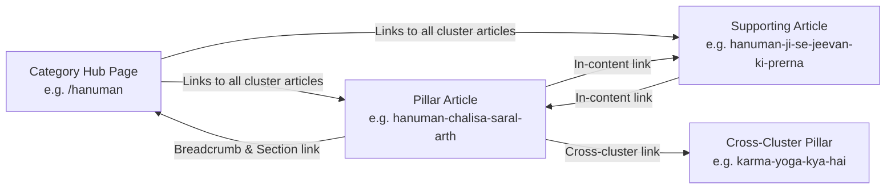

# BhaktiMania SEO & Content Quality Comprehensive Audit — Phase 1

> **दस्तावेज़ प्रकार:** Technical & On-Page SEO / Content Quality Audit  
> **वेबसाइट:** [BhaktiMania (https://bhaktimania.com)](https://bhaktimania.com)  
> **ऑडिट तिथि:** 21 मार्च 2026  
> **ऑडिट का दायरा:** Read-Only Analysis of Application Architecture, 18 Published Articles, Categories, Schema, and Crawlability  
> **कार्यकारी एजेंट:** `bhaktimania-seo` (BhaktiMania Technical & On-Page SEO Agent)  
> **दिशानिर्देश:** Audit-only; zero modifications to codebase, database, or production configurations.

---

## 1. Executive Summary

BhaktiMania is a modern, fast, spiritually grounded Hindi devotional web platform engineered on Next.js 16 (App Router), React 19, TypeScript, and Tailwind CSS v4. The platform serves authentic, research-backed Hindi devotional content across key Sanatan Dharma themes: Shri Hanuman, Radha Krishna, Bhagwan Shiv, Shrimad Bhagavad Gita, Bhakti Vichar, Vrats & Festivals, Vrindavan Dham, and Sant Premanand Ji Maharaj.

### Key Audit Findings at a Glance

1. **Bimodal Content Quality:** The 18 published articles exhibit a sharp divergence in editorial depth:
   - **Phase 1 Expanded Articles (Articles 11–18 + Article 1):** 700–1,134 words per article, rich multi-heading structures (H2s), bulleted practical tips, and dedicated contextual internal link sections.
   - **Legacy Seed Articles (Articles 4–10):** Very thin stubs (53–198 words each, containing only 1 or 2 sections) that represent severe thin-content search penalties if indexed without enrichment.
2. **Critical Keyword Cannibalization:** There are 5 direct 1-to-1 cannibalization pairs where a legacy thin stub directly targets the identical keyword and search intent as a Phase 1 comprehensive pillar article (e.g., `hanuman-chalisa-paath-kyun-karein` [53 words] vs. `hanuman-chalisa-saral-arth` [1,134 words]; `ekadashi-vrat-adhyatmik-mahatva` [67 words] vs. `ekadashi-kya-hai` [832 words]).
3. **Internal Linking Asymmetry:** Articles 11–18 link downwards to legacy articles 1–10 and category hubs, but articles 1–10 have **zero outbound links** from their body text, creating dead ends in link equity distribution.
4. **Zero Featured Images Across Entire Inventory:** All 18 articles currently have `featuredImageUrl: null` and `featuredImageAlt: null`, leaving OpenGraph, Twitter Cards, Google Discover, and Google Image Search without visual assets.
5. **Technical SEO Strengths & Schema Gaps:**
   - *Strengths:* Clean canonical URLs, automated dynamic XML sitemap, clean `robots.txt` excluding `/admin/`, fast SSR/SSG rendering, zero console errors, semantic HTML, and mobile-friendly responsive typography.
   - *Gaps:* `Article` JSON-LD schema is missing `datePublished`, `dateModified`, and `image`. `FAQPage` schema is completely missing despite strong devotional Q&A opportunities. `Organization` and SearchAction schemas are absent on the homepage.
6. **Orphan Category Hub:** The `/premanand-ji` category hub is live and indexed in the sitemap, but contains **0 published articles**, displaying an empty notice to readers and search engines.

---

## 2. Current SEO Architecture & Technical Infrastructure

### 2.1 URL Structure & Route Organization
* **Base Domain:** `https://bhaktimania.com`
* **Article URLs:** `/bhakti-gyaan/[slug]` (e.g., `https://bhaktimania.com/bhakti-gyaan/hanuman-chalisa-saral-arth`)
  - *Evaluation:* Clean, descriptive, semantic Hindi-transliterated slugs. The `/bhakti-gyaan/` prefix provides consistent hierarchical directory nesting for editorial articles.
* **Category Hub URLs:** Root-level slugs matching deity/theme taxonomy:
  - `/hanuman`
  - `/radha-krishna`
  - `/shiv`
  - `/bhagavad-gita`
  - `/bhakti-vichar`
  - `/festivals`
  - `/vrindavan`
  - `/premanand-ji`
* **Institutional Pages:** `/about`, `/contact`, `/privacy-policy`, `/terms`, `/disclaimer`, `/affiliate-disclosure`
* **Protected Portal:** `/admin/*` (Strictly excluded via `robots.ts` and `metadata: { robots: { index: false, follow: false } }`).

### 2.2 Metadata & Head Architecture
* **Framework:** Next.js 16 App Router metadata API with `generateMetadata` on dynamic routes.
* **Metadata Base:** `https://bhaktimania.com` configured via `siteConfig.url`.
* **Title Template:** `%s | BhaktiMania` ensuring unified branding across all sub-pages.
* **Canonical URLs:** Dynamically generated using helper `getCanonicalUrl(pathname)`.
* **OpenGraph & Twitter Cards:** Configured with `type: "article"`, `siteName: "BhaktiMania"`, and fallback to default title/description.
* **Site Verification:**
  - Google AdSense Account: `<meta name="google-adsense-account" content="ca-pub-3380573668907472"/>` deployed in `<head>`.
  - Google Search Console: Environment hook `NEXT_PUBLIC_GOOGLE_SITE_VERIFICATION` supported in `app/layout.tsx`.

### 2.3 Structured Data (JSON-LD) Implementations
| Page Type | Implemented Schemas | Status | Identified Opportunities |
| :--- | :--- | :--- | :--- |
| **Homepage (`/`)** | `WebSite` | Adequate | Add `Organization` (logo, description, sameAs) & `potentialAction` (SearchAction) |
| **Category Hubs (`/[slug]`)** | `BreadcrumbList` | Adequate | Add `CollectionPage` or `ItemList` schema for article listings |
| **Article Pages (`/bhakti-gyaan/[slug]`)** | `BreadcrumbList`, `Article` | Needs Improvement | Add `datePublished` (ISO), `dateModified` (ISO), `image`, and `FAQPage` schema |

### 2.4 Robots & Sitemap Configuration
* **`app/robots.ts`:**
  ```text
  User-Agent: *
  Allow: /
  Disallow: /admin/
  Sitemap: https://bhaktimania.com/sitemap.xml
  ```
  - *Status:* Clean, correct, prevents indexing of administrative interfaces.
* **`app/sitemap.ts`:**
  - Dynamic generator querying Supabase / fallback static lists.
  - Generates 8 static institutional routes, 8 category hub routes (`changeFrequency: "daily"`, `priority: 0.85`), and 18 published article routes (`changeFrequency: "weekly"`, `priority: 0.8`).
  - *Status:* Fully functional, valid XML syntax.

---

## 3. Comprehensive 18-Article Content & SEO Audit

Below is the detailed factual evaluation of all 18 articles currently live in the BhaktiMania inventory.

---

### Article 1: `sacchi-bhakti-kya-hai`
* **URL:** `https://bhaktimania.com/bhakti-gyaan/sacchi-bhakti-kya-hai`
* **Article Title / H1:** सच्ची भक्ति क्या है? दैनिक जीवन में भक्ति का महत्व
* **SEO Title:** सच्ची भक्ति क्या है? दैनिक जीवन में भक्ति का महत्व | BhaktiMania
* **Meta Description:** जानिए भक्ति का वास्तविक अर्थ, मन की एकाग्रता और इसे अपने दैनिक जीवन का हिस्सा कैसे बनाया जा सकता है।
* **Category:** भक्ति विचार (`/bhakti-vichar`) | **Symbol:** दीप | **Read Time:** 6 मिनट
* **Word Count:** 726 शब्द | **Sections:** 6 | **Paragraphs:** 12 | **Bullets:** 4
* **Headings Structure (H2s):**
  1. भक्ति का वास्तविक और सरल अर्थ
  2. पूजा-पाठ और भक्ति में क्या अंतर है?
  3. दैनिक जीवन में भक्ति को कैसे अपनाएं?
  4. कर्म करते हुए ईश्वर का स्मरण (कर्मयोग)
  5. मन की शांति और समर्पण का आनंद
  6. उपसंहार: जीवन को भक्तिमय बनाएं
* **Search Intent:** Informational / Philosophical / Practical Spirituality
* **Suggested Primary Keyword:** सच्ची भक्ति क्या है (*SEO hypothesis — search volume not verified*)
* **Suggested Secondary Keywords:** दैनिक जीवन में भक्ति का महत्व, पूजा और भक्ति में अंतर, भक्ति का वास्तविक अर्थ (*SEO hypothesis — search volume not verified*)
* **Long-Tail Keyword Opportunities:** सच्चे भक्त के लक्षण, गृहस्थ जीवन में भक्ति कैसे करें, मन को शांत रखने के लिए भक्ति (*SEO hypothesis — search volume not verified*)
* **Content Depth & Clarity:** Strong. Explains Sanskrit root 'भज्' (Bhaj), differentiates ritual vs. heart disposition, and provides actionable daily life tips.
* **Hindi Language Quality:** High-standard, serene, grammatically pure devanagari.
* **Keyword Stuffing Risk:** Very low (natural phrasing).
* **Cannibalization Risk:** Moderate overlap with Article 8 (`mann-ki-shanti-ke-liye-bhakti`) and Article 17 (`subah-ki-10-minute-bhakti-dincharya`).
* **Internal Links Present in Body:** **0** (Zero outbound internal links).
* **Author Info:** Default editorial team.
* **Featured Image / Alt:** None (`null`).
* **FAQ Opportunity:** High ("पूजा और भक्ति में क्या अंतर है?", "क्या गृहस्थ जीवन में भक्ति संभव है?").
* **E-E-A-T & Trust Signals:** Strong philosophical grounding, quotes Bhagavad Gita 8.7.

---

### Article 2: `radha-krishna-bhakti`
* **URL:** `https://bhaktimania.com/bhakti-gyaan/radha-krishna-bhakti`
* **Article Title / H1:** राधा कृष्ण की भक्ति हमें क्या सिखाती है?
* **SEO Title:** राधा कृष्ण की भक्ति हमें क्या सिखाती है? | BhaktiMania
* **Meta Description:** प्रेम, समर्पण, निस्वार्थ सेवा और निष्काम भक्ति से जुड़े कुछ सुंदर और गहन आध्यात्मिक विचार।
* **Category:** राधा कृष्ण (`/radha-krishna`) | **Symbol:** मोरपंख | **Read Time:** 5 मिनट
* **Word Count:** 371 शब्द | **Sections:** 4 | **Paragraphs:** 7 | **Bullets:** 3
* **Headings Structure (H2s):**
  1. राधा-कृष्ण प्रेम का आध्यात्मिक रहस्य
  2. निस्वार्थ समर्पण और निष्काम भाव
  3. दैनिक जीवन में राधा-कृष्ण के आदर्श
  4. निष्कर्ष
* **Search Intent:** Informational / Devotional Reflection
* **Suggested Primary Keyword:** राधा कृष्ण की भक्ति (*SEO hypothesis — search volume not verified*)
* **Suggested Secondary Keywords:** राधा कृष्ण प्रेम का रहस्य, निष्काम प्रेम क्या है, राधा कृष्ण की सीख (*SEO hypothesis — search volume not verified*)
* **Long-Tail Opportunities:** राधा कृष्ण से सच्चा प्रेम कैसे सीखें, राधा रानी का समर्पण भाव (*SEO hypothesis — search volume not verified*)
* **Content Depth & Clarity:** Adequate for introductory reflection, but noticeably brief (371 words).
* **Cannibalization Risk:** **High** — Overlaps heavily with Article 18 (`radha-krishna-prem-samarpan`, 744 words).
* **Internal Links in Body:** **0**.
* **Featured Image / Alt:** None (`null`).
* **Main Opportunity:** Expand with theological references or position as an entry-level primer leading directly to Article 18.

---

### Article 3: `hanuman-ji-vishwas-samarpan`
* **URL:** `https://bhaktimania.com/bhakti-gyaan/hanuman-ji-vishwas-samarpan`
* **Article Title / H1:** हनुमान जी से सीखें विश्वास और समर्पण
* **SEO Title:** हनुमान जी से सीखें विश्वास और समर्पण | BhaktiMania
* **Meta Description:** हनुमान जी का जीवन हमें अटूट निष्ठा, निस्वार्थ सेवा और प्रभु के प्रति पूर्ण विश्वास की प्रेरणा देता है।
* **Category:** हनुमान (`/hanuman`) | **Symbol:** गदा | **Read Time:** 5 मिनट
* **Word Count:** 334 शब्द | **Sections:** 3 | **Paragraphs:** 6 | **Bullets:** 3
* **Headings Structure (H2s):**
  1. दास्य भाव और समर्पण की पराकाष्ठा
  2. असंभव को संभव करने वाला विश्वास
  3. आधुनिक जीवन में हनुमान जी की शिक्षाएं
* **Search Intent:** Inspirational / Devotional Life Guidance
* **Suggested Primary Keyword:** हनुमान जी का समर्पण भाव (*SEO hypothesis — search volume not verified*)
* **Suggested Secondary Keywords:** हनुमान जी से क्या सीखें, हनुमान जी का विश्वास, दास्य भाव भक्ति (*SEO hypothesis — search volume not verified*)
* **Cannibalization Risk:** **High** — Competes directly with Article 12 (`hanuman-ji-se-jeevan-ki-prerna`, 1,076 words).
* **Internal Links in Body:** **0**.
* **Featured Image / Alt:** None (`null`).
* **Main Opportunity:** Interlink bi-directionally with Article 12, focusing Article 3 specifically on "दास्य भाव" (servant devotion).

---

### Article 4: `bhagavad-gita-5-sandesh`
* **URL:** `https://bhaktimania.com/bhakti-gyaan/bhagavad-gita-5-sandesh`
* **Article Title / H1:** श्रीमद्भगवद्गीता के 5 संदेश जो जीवन बदल सकते हैं
* **SEO Title:** श्रीमद्भगवद्गीता के 5 संदेश जो जीवन बदल सकते हैं | BhaktiMania
* **Meta Description:** गीता के श्लोकों से कर्मयोग, मन के नियंत्रण और जीवन में आंतरिक शांति प्राप्त करने के व्यावहारिक सूत्र।
* **Category:** भगवद्गीता (`/bhagavad-gita`) | **Symbol:** चक्र | **Read Time:** 6 मिनट (Mismatched: takes <1.5 min to read)
* **Word Count:** **198 शब्द** (Thin Content Warning) | **Sections:** 2 | **Paragraphs:** 6 | **Bullets:** 0
* **Headings Structure (H2s):**
  1. गीता: जीवन जीने का व्यावहारिक दर्शन
  2. जीवन के 5 प्रमुख आध्यात्मिक सूत्र
* **Search Intent:** Listicle / Practical Life Wisdom from Scripture
* **Suggested Primary Keyword:** भगवद्गीता के संदेश (*SEO hypothesis — search volume not verified*)
* **Suggested Secondary Keywords:** गीता के 5 अनमोल विचार, गीता के जीवन सूत्र, गीता के मुख्य उपदेश (*SEO hypothesis — search volume not verified*)
* **Content Quality Defect:** Lists the 5 lessons only as short paragraphs without dedicated sub-headings (H3), Sanskrit shlokas, or practical workplace/student examples.
* **Internal Links in Body:** **0**.
* **Featured Image / Alt:** None (`null`).
* **Main Opportunity:** Major editorial expansion to 800+ words with explicit shlokas (2.47, 6.5, etc.) and H3 structure for each of the 5 lessons.

---

### Article 5: `mahadev-bhakti-shiv-naam-mahatva`
* **URL:** `https://bhaktimania.com/bhakti-gyaan/mahadev-bhakti-shiv-naam-mahatva`
* **Article Title / H1:** महादेव की भक्ति और शिव नाम का आध्यात्मिक महत्व
* **SEO Title:** महादेव की भक्ति और शिव नाम का आध्यात्मिक महत्व | BhaktiMania
* **Meta Description:** भगवान शिव की साधना, पंचाक्षर मंत्र 'ॐ नमः शिवाय' का महत्व और ध्यान की गहराई को समझें।
* **Category:** शिव (`/shiv`) | **Symbol:** त्रिशूल | **Read Time:** 5 मिनट (Mismatched: takes <1 min to read)
* **Word Count:** **130 शब्द** (Severe Thin Content / Stub) | **Sections:** 2 | **Paragraphs:** 2 | **Bullets:** 0
* **Headings Structure (H2s):**
  1. भोलेनाथ: सरलता और वैराग्य के देवता
  2. पंचाक्षर मंत्र की शक्ति
* **Search Intent:** Devotional Mantra Explanation / Shiv Name Glory
* **Suggested Primary Keyword:** शिव नाम का महत्व (*SEO hypothesis — search volume not verified*)
* **Suggested Secondary Keywords:** ॐ नमः शिवाय का अर्थ, महादेव की भक्ति कैसे करें, पंचाक्षर मंत्र का महत्व (*SEO hypothesis — search volume not verified*)
* **Cannibalization Risk:** **High** — Overshadowed by Article 13 (`shiv-bhakti-ka-saral-arth`, 852 words).
* **Internal Links in Body:** **0**.
* **Featured Image / Alt:** None (`null`).
* **Main Opportunity:** Reposition specifically around the **पंचाक्षर मंत्र 'ॐ नमः शिवाय' जप विधि एवं महत्व** to give it a distinct non-overlapping search query focus.

---

### Article 6: `ekadashi-vrat-adhyatmik-mahatva`
* **URL:** `https://bhaktimania.com/bhakti-gyaan/ekadashi-vrat-adhyatmik-mahatva`
* **Article Title / H1:** एकादशी व्रत का आध्यात्मिक महत्व
* **SEO Title:** एकादशी व्रत का आध्यात्मिक महत्व | BhaktiMania
* **Meta Description:** सनातन परंपरा में एकादशी व्रत की महिमा, आत्मसंयम के नियम और इससे मिलने वाली आध्यात्मिक शांति।
* **Category:** त्योहार (`/festivals`) | **Symbol:** कलश | **Read Time:** 4 मिनट
* **Word Count:** **67 शब्द** (Critical Thin Content / Stub) | **Sections:** 1 | **Paragraphs:** 1 | **Bullets:** 0
* **Headings Structure (H2s):**
  1. एकादशी: इंद्रियों पर नियंत्रण का पर्व
* **Search Intent:** Informational / Vrat Guidelines
* **Suggested Primary Keyword:** एकादशी व्रत का महत्व (*SEO hypothesis — search volume not verified*)
* **Cannibalization Risk:** **Critical** — Article 15 (`ekadashi-kya-hai`, 832 words) already fully answers this exact topic.
* **Internal Links in Body:** **0**.
* **Featured Image / Alt:** None (`null`).
* **Main Opportunity:** Either substantially expand with scriptural stories of Padma Purana on Ekadashi or consolidate with Article 15.

---

### Article 7: `vrindavan-jane-se-pehle-baatein`
* **URL:** `https://bhaktimania.com/bhakti-gyaan/vrindavan-jane-se-pehle-baatein`
* **Article Title / H1:** वृंदावन जाने से पहले जानने योग्य बातें
* **SEO Title:** वृंदावन जाने से पहले जानने योग्य बातें | BhaktiMania
* **Meta Description:** वृंदावन धाम दर्शन, प्रमुख मंदिरों के दर्शन का समय और यात्रा के दौरान ध्यान रखने योग्य महत्वपूर्ण बातें।
* **Category:** वृंदावन (`/vrindavan`) | **Symbol:** कमल | **Read Time:** 6 मिनट
* **Word Count:** **76 शब्द** (Critical Thin Content / Stub) | **Sections:** 1 | **Paragraphs:** 1 | **Bullets:** 0
* **Headings Structure (H2s):**
  1. धाम यात्रा का आध्यात्मिक दृष्टिकोण
* **Search Intent:** Pilgrimage Travel Tips & Temple Etiquette
* **Suggested Primary Keyword:** वृंदावन जाने से पहले नियम (*SEO hypothesis — search volume not verified*)
* **Cannibalization Risk:** **Critical** — Direct overlap with Article 16 (`vrindavan-yatra-planning-guide`, 797 words).
* **Internal Links in Body:** **0**.
* **Featured Image / Alt:** None (`null`).
* **Main Opportunity:** Pivot into a highly specific **"वृंदावन में बंदरों, ई-रिक्शा, परिक्रमा शिष्टाचार और मंदिर दर्शन समय के व्यावहारिक नियम"** checklist to differentiate from the general itinerary guide.

---

### Article 8: `mann-ki-shanti-ke-liye-bhakti`
* **URL:** `https://bhaktimania.com/bhakti-gyaan/mann-ki-shanti-ke-liye-bhakti`
* **Article Title / H1:** मन की शांति के लिए भक्ति को जीवन में कैसे अपनाएं?
* **SEO Title:** मन की शांति के लिए भक्ति को जीवन में कैसे अपनाएं? | BhaktiMania
* **Meta Description:** व्यस्त दिनचर्या और मानसिक तनाव के बीच ईश्वर स्मरण और शांत मन बनाए रखने के सरल आध्यात्मिक उपाय।
* **Category:** भक्ति विचार (`/bhakti-vichar`) | **Symbol:** दीप | **Read Time:** 4 मिनट
* **Word Count:** **73 शब्द** (Critical Thin Content / Stub) | **Sections:** 1 | **Paragraphs:** 1 | **Bullets:** 0
* **Headings Structure (H2s):**
  1. आंतरिक शांति का स्रोत
* **Search Intent:** Mental Peace / Stress Relief through Bhakti
* **Suggested Primary Keyword:** मन की शांति के लिए भक्ति (*SEO hypothesis — search volume not verified*)
* **Cannibalization Risk:** **High** — Overlaps with Article 1 (`sacchi-bhakti-kya-hai`) and Article 17 (`subah-ki-10-minute-bhakti-dincharya`).
* **Internal Links in Body:** **0**.
* **Featured Image / Alt:** None (`null`).
* **Main Opportunity:** Expand into an actionable guide on **"मानसिक तनाव, चिंता और नकारात्मक विचारों से मुक्ति हेतु नाम-जप और ध्यान"**.

---

### Article 9: `shri-krishna-jeevan-prernayein`
* **URL:** `https://bhaktimania.com/bhakti-gyaan/shri-krishna-jeevan-prernayein`
* **Article Title / H1:** श्री कृष्ण के जीवन से मिलने वाली 5 प्रेरणाएं
* **SEO Title:** श्री कृष्ण के जीवन से मिलने वाली 5 प्रेरणाएं | BhaktiMania
* **Meta Description:** मुस्कान के साथ चुनौतियों का सामना करना, मित्रता का आदर्श और जीवन में समभाव रखने की अनुपम सीख।
* **Category:** राधा कृष्ण (`/radha-krishna`) | **Symbol:** मोरपंख | **Read Time:** 5 मिनट
* **Word Count:** **71 शब्द** (Critical Thin Content / Stub) | **Sections:** 1 | **Paragraphs:** 1 | **Bullets:** 0
* **Headings Structure (H2s):**
  1. भगवान श्री कृष्ण: पूर्ण पुरुषोत्तम का जीवन
* **Search Intent:** Inspirational Listicle / Krishna Life Lessons
* **Suggested Primary Keyword:** श्री कृष्ण के जीवन से सीख (*SEO hypothesis — search volume not verified*)
* **Suggested Secondary Keywords:** कृष्ण जी की 5 प्रेरणाएं, कृष्ण से क्या सीखें, श्री कृष्ण के जीवन मूल्य (*SEO hypothesis — search volume not verified*)
* **Defect:** Title promises "5 प्रेरणाएं" (5 inspirations), but the stub body contains only 1 generic paragraph and does not even list the 5 inspirations!
* **Internal Links in Body:** **0**.
* **Featured Image / Alt:** None (`null`).
* **Main Opportunity:** Urgent editorial expansion delivering the promised 5 inspirations (मुस्कान, निष्काम कर्म, सुदामा मित्रता, समभाव, धर्म रक्षा) with H3 sub-headings.

---

### Article 10: `hanuman-chalisa-paath-kyun-karein`
* **URL:** `https://bhaktimania.com/bhakti-gyaan/hanuman-chalisa-paath-kyun-karein`
* **Article Title / H1:** हनुमान चालीसा का पाठ क्यों किया जाता है?
* **SEO Title:** हनुमान चालीसा का पाठ क्यों किया जाता है? | BhaktiMania
* **Meta Description:** गोस्वामी तुलसीदास जी द्वारा रचित हनुमान चालीसा के पाठ का आध्यात्मिक महत्व, शक्ति और फल।
* **Category:** हनुमान (`/hanuman`) | **Symbol:** गदा | **Read Time:** 5 मिनट
* **Word Count:** **53 शब्द** (Shortest Stub in Website) | **Sections:** 1 | **Paragraphs:** 1 | **Bullets:** 0
* **Headings Structure (H2s):**
  1. हनुमान चालीसा: भक्ति और आत्मबल का महामंत्र
* **Search Intent:** Informational Q&A / Benefits of Hanuman Chalisa
* **Suggested Primary Keyword:** हनुमान चालीसा का पाठ क्यों करना चाहिए (*SEO hypothesis — search volume not verified*)
* **Cannibalization Risk:** **Severe** — Directly conflicts with Article 11 (`hanuman-chalisa-saral-arth`, 1,134 words).
* **Internal Links in Body:** **0**.
* **Featured Image / Alt:** None (`null`).
* **Main Opportunity:** Specialize on **"हनुमान चालीसा के पाठ के नियम, समय, सही विधि और 100 बार पाठ का महत्व"** or merge.

---

### Article 11: `hanuman-chalisa-saral-arth`
* **URL:** `https://bhaktimania.com/bhakti-gyaan/hanuman-chalisa-saral-arth`
* **Article Title / H1:** हनुमान चालीसा का सरल अर्थ: चौपाइयों को समझने का प्रयास
* **SEO Title:** हनुमान चालीसा का सरल अर्थ: चौपाइयों को समझने का प्रयास | BhaktiMania
* **Meta Description:** गोस्वामी तुलसीदास जी द्वारा रचित श्री हनुमान चालीसा का सरल, भावपूर्ण और व्यावहारिक अर्थ। जानें प्रमुख चौपाइयों का मर्म और दैनिक जीवन में उनके आध्यात्मिक संदेश।
* **Category:** हनुमान (`/hanuman`) | **Symbol:** गदा | **Read Time:** 7 मिनट
* **Word Count:** **1,134 शब्द** (Flagship Pillar Article) | **Sections:** 11 | **Paragraphs:** 18 | **Bullets:** 9
* **Headings Structure (H2s):**
  1. हनुमान चालीसा की ऐतिहासिक व भक्तिमय पृष्ठभूमि
  2. मंगलाचरण: मन के दर्पण को शुद्ध करने का संकल्प
  3. हनुमान जी का स्वरूप एवं दिव्य गुण: प्रमुख चौपाइयों का अर्थ
  4. सेवा और कर्तव्यनिष्ठा: 'राम काज कीन्हें बिनु मोहि कहाँ विश्राम'
  5. संकटमोचन और निर्भयता का संदेश
  6. अष्टसिद्धि, नवनिधि और समर्पण का सर्वोच्च फल
  7. समापन दोहा: हृदय में ईश्वर की प्रतिष्ठा
  8. पाठकों के लिए व्यावहारिक मार्गदर्शन: हनुमान चालीसा का पाठ कैसे करें?
  9. निष्कर्ष: श्रद्धा और ज्ञान का समन्वय
  10. संबंधित विषय एवं आंतरिक कड़ियां
* **Search Intent:** Deep Informational / Meaning & Commentary
* **Suggested Primary Keyword:** हनुमान चालीसा का सरल अर्थ (*SEO hypothesis — search volume not verified*)
* **Suggested Secondary Keywords:** हनुमान चालीसा चौपाई अर्थ हिंदी, हनुमान चालीसा का भावार्थ, तुलसीदास कृत हनुमान चालीसा (*SEO hypothesis — search volume not verified*)
* **Long-Tail Keyword Opportunities:** राम काज कीन्हें बिनु मोहि कहाँ विश्राम अर्थ, अष्ट सिद्धि नव निधि के दाता अर्थ (*SEO hypothesis — search volume not verified*)
* **Content Depth & Clarity:** Outstanding. One of the strongest pillars on the site.
* **Internal Links in Body:** **5 active links** (`/hanuman`, `/bhakti-gyaan/hanuman-ji-vishwas-samarpan`, `/bhakti-gyaan/hanuman-chalisa-paath-kyun-karein`, `/bhakti-vichar`, `/bhakti-gyaan/subah-ki-10-minute-bhakti-dincharya`).
* **Featured Image / Alt:** None (`null`).
* **FAQ Opportunity:** Prime candidate for FAQ Schema (e.g., "हनुमान चालीसा का पाठ कब करना चाहिए?", "क्या बिना नहाए हनुमान चालीसा पढ़ सकते हैं?").

---

### Article 12: `hanuman-ji-se-jeevan-ki-prerna`
* **URL:** `https://bhaktimania.com/bhakti-gyaan/hanuman-ji-se-jeevan-ki-prerna`
* **Article Title / H1:** हनुमान जी से मिलने वाली जीवन की 5 प्रेरणाएं
* **SEO Title:** हनुमान जी से मिलने वाली जीवन की 5 प्रेरणाएं | BhaktiMania
* **Meta Description:** श्री हनुमान जी के पावन चरित्र से सीखें सेवा, विनम्रता, अदम्य साहस, अनन्य समर्पण और धैर्य के 5 शाश्वत जीवन सूत्र जो आधुनिक जीवन में स्थिरता और सफलता दिलाते हैं।
* **Category:** हनुमान (`/hanuman`) | **Symbol:** गदा | **Read Time:** 5 मिनट
* **Word Count:** **1,076 शब्द** (Strong Pillar Article) | **Sections:** 9 | **Paragraphs:** 13 | **Bullets:** 8
* **Headings Structure (H2s):**
  1. निस्वार्थ सेवा भाव (Selfless Service)
  2. विद्या और बल के साथ विनम्रता (Humility with Excellence)
  3. विपरीत परिस्थितियों में अदम्य साहस (Courage in Adversity)
  4. लक्ष्य के प्रति अनन्य समर्पण (Single-Minded Dedication)
  5. संकट के क्षणों में धैर्य और आशावादिता (Patience & Resilience)
  6. व्यावहारिक जीवन में अपनाने के सूत्र
  7. निष्कर्ष
  8. संबंधित विषय एवं आंतरिक कड़ियां
* **Search Intent:** Inspirational / Character Development from Ramayan
* **Suggested Primary Keyword:** हनुमान जी से प्रेरणा (*SEO hypothesis — search volume not verified*)
* **Suggested Secondary Keywords:** हनुमान जी के गुण, हनुमान जी के 5 जीवन सूत्र, संकटमोचन से सीख (*SEO hypothesis — search volume not verified*)
* **Content Depth & Clarity:** Excellent. Well-structured, actionable, bridging Ramcharitmanas verses with modern workplace/life contexts.
* **Internal Links in Body:** **5 active links** (`/hanuman`, Article 3, Article 10, Article 11, Article 14).
* **Featured Image / Alt:** None (`null`).

---

### Article 13: `shiv-bhakti-ka-saral-arth`
* **URL:** `https://bhaktimania.com/bhakti-gyaan/shiv-bhakti-ka-saral-arth`
* **Article Title / H1:** शिव भक्ति का सरल अर्थ और दैनिक जीवन में उसका महत्व
* **SEO Title:** शिव भक्ति का सरल अर्थ और दैनिक जीवन में उसका महत्व | BhaktiMania
* **Meta Description:** भगवान शिव की भक्ति का वास्तविक दार्शनिक अर्थ, सरलता, आत्मचिंतन, वैराग्य और क्रोध पर नियंत्रण के व्यावहारिक सूत्र जो दैनिक जीवन को शांत और संतुलित बनाते हैं।
* **Category:** भगवान शिव (`/shiv`) | **Symbol:** त्रिशूल | **Read Time:** 5 मिनट
* **Word Count:** **852 शब्द** (Strong Pillar Article) | **Sections:** 9 | **Paragraphs:** 11 | **Bullets:** 8
* **Headings Structure (H2s):**
  1. 'शिव' शब्द का वास्तविक अर्थ: कल्याण और चेतना
  2. सरलता और आडंबरहीनता (The Beauty of Simplicity)
  3. विष को कंठ में धारण करना: क्रोध और नकारात्मकता का प्रबंधन
  4. वैराग्य और गृहस्थ का अनुपम समन्वय
  5. आत्मचिंतन और मौन का अभ्यास
  6. महत्वपूर्ण संपादकीय मर्यादा टिप्पणी
  7. निष्कर्ष
  8. संबंधित विषय एवं आंतरिक कड़ियां
* **Search Intent:** Philosophical / Meditation / Emotional Balance
* **Suggested Primary Keyword:** शिव भक्ति का सरल अर्थ (*SEO hypothesis — search volume not verified*)
* **Suggested Secondary Keywords:** भगवान शिव की पूजा कैसे करें, नीलकंठ का संदेश, शिव और गृहस्थ धर्म (*SEO hypothesis — search volume not verified*)
* **Content Depth & Clarity:** Very high. Contains an explicit editorial disclaimer warning against superstitious claims and highlighting inner purification.
* **Internal Links in Body:** **5 active links** (`/shiv`, Article 5, Article 1, `/bhakti-vichar`, Article 17).
* **Featured Image / Alt:** None (`null`).

---

### Article 14: `karma-yoga-kya-hai`
* **URL:** `https://bhaktimania.com/bhakti-gyaan/karma-yoga-kya-hai`
* **Article Title / H1:** कर्म योग क्या है? श्रीमद्भगवद्गीता की दृष्टि से सरल समझ
* **SEO Title:** कर्म योग क्या है? श्रीमद्भगवद्गीता की दृष्टि से सरल समझ | BhaktiMania
* **Meta Description:** श्रीमद्भगवद्गीता के अनुसार कर्म योग और निष्काम कर्म का वास्तविक अर्थ। जानें कैसे परिणाम की चिंता छोड़कर वर्तमान कर्तव्य में श्रेष्ठता हासिल की जा सकती है।
* **Category:** श्रीमद्भगवद्गीता (`/bhagavad-gita`) | **Symbol:** चक्र | **Read Time:** 6 मिनट
* **Word Count:** **848 शब्द** (Strong Pillar Article) | **Sections:** 8 | **Paragraphs:** 11 | **Bullets:** 10
* **Headings Structure (H2s):**
  1. 'कर्म योग' शब्द का अर्थ और परिभाषा
  2. गीता का मूल श्लोक: अधिकार कर्म पर है, फल पर नहीं
  3. निष्काम कर्म क्या है?
  4. 'योगः कर्मसु कौशलम्': कर्म में कुशलता ही योग है
  5. आधुनिक जीवन में कर्म योग के व्यावहारिक उदाहरण
  6. निष्कर्ष: जीवन को कर्मयोगमय बनाने के 3 संकल्प
  7. संबंधित विषय एवं आंतरिक कड़ियां
* **Search Intent:** Philosophical / Educational / Bhagavad Gita Concepts
* **Suggested Primary Keyword:** कर्म योग क्या है (*SEO hypothesis — search volume not verified*)
* **Suggested Secondary Keywords:** निष्काम कर्म का अर्थ, गीता में कर्मयोग, कर्मण्येवाधिकारस्ते अर्थ हिंदी (*SEO hypothesis — search volume not verified*)
* **Long-Tail Opportunities:** योगः कर्मसु कौशलम् का अर्थ, नौकरी में कर्मयोग कैसे अपनाएं (*SEO hypothesis — search volume not verified*)
* **Content Depth & Clarity:** Outstanding. Translates Gita 2.47 and 2.50 into daily application without religious dogma.
* **Internal Links in Body:** **4 active links** (`/bhagavad-gita`, Article 4, Article 1, Article 12).
* **Featured Image / Alt:** None (`null`).

---

### Article 15: `ekadashi-kya-hai`
* **URL:** `https://bhaktimania.com/bhakti-gyaan/ekadashi-kya-hai`
* **Article Title / H1:** एकादशी क्या है? व्रत की परंपरा और आध्यात्मिक दृष्टिकोण
* **SEO Title:** एकादशी क्या है? व्रत की परंपरा और आध्यात्मिक दृष्टिकोण | BhaktiMania
* **Meta Description:** एकादशी तिथि का अर्थ, व्रत की सनातन परंपराएं, ग्यारह इंद्रियों का संयम, पारण का महत्व और स्वास्थ्य संबंधी आवश्यक सावधानियों पर एक संतुलित आध्यात्मिक मार्गदर्शिका।
* **Category:** त्योहार एवं व्रत (`/festivals`) | **Symbol:** कलश | **Read Time:** 6 मिनट
* **Word Count:** **832 शब्द** (Strong Pillar Article) | **Sections:** 8 | **Paragraphs:** 10 | **Bullets:** 15
* **Headings Structure (H2s):**
  1. 'एकादशी' का दार्शनिक अर्थ: 11 इंद्रियों पर संयम
  2. एकादशी व्रत की विविध परंपराएं
  3. पारण (Parana) का महत्व और समय
  4. स्वास्थ्य संबंधी आवश्यक सावधानियां एवं अस्वीकरण
  5. एकादशी के दिन करने योग्य 4 आध्यात्मिक अभ्यास
  6. निष्कर्ष
  7. संबंधित विषय एवं आंतरिक कड़ियां
* **Search Intent:** Comprehensive Guide / Vrat Meaning & Health Precautions
* **Suggested Primary Keyword:** एकादशी क्या है (*SEO hypothesis — search volume not verified*)
* **Suggested Secondary Keywords:** एकादशी व्रत के नियम, एकादशी पारण का समय, एकादशी का आध्यात्मिक महत्व (*SEO hypothesis — search volume not verified*)
* **Content Depth & Clarity:** High quality. Includes medical/health disclaimer regarding fasting.
* **Internal Links in Body:** **4 active links** (`/festivals`, Article 6, Article 1, Article 13).
* **Featured Image / Alt:** None (`null`).

---

### Article 16: `vrindavan-yatra-planning-guide`
* **URL:** `https://bhaktimania.com/bhakti-gyaan/vrindavan-yatra-planning-guide`
* **Article Title / H1:** वृंदावन की यात्रा की योजना कैसे बनाएं?
* **SEO Title:** वृंदावन की यात्रा की योजना कैसे बनाएं? | BhaktiMania
* **Meta Description:** वृंदावन एवं ब्रज धाम की शांतिपूर्ण और व्यवस्थित यात्रा की योजना कैसे बनाएं? प्रमुख धार्मिक स्थल, यात्रा शिष्टाचार, भीड़ प्रबंधन और दर्शन संबंधी आवश्यक मार्गदर्शिका।
* **Category:** वृंदावन एवं धाम (`/vrindavan`) | **Symbol:** कमल | **Read Time:** 7 मिनट
* **Word Count:** **797 शब्द** (Strong Pillar Travel Guide) | **Sections:** 9 | **Paragraphs:** 7 | **Bullets:** 17
* **Headings Structure (H2s):**
  1. यात्रा की प्राथमिक तैयारी और पहुंचने के साधन
  2. दर्शन समय और नियमों के सत्यापन संबंधी अनिवार्य सूचना
  3. प्रमुख दर्शनीय धार्मिक स्थल
  4. 2 से 3 दिन की एक संतुलित यात्रा रूपरेखा
  5. मंदिर शिष्टाचार एवं व्यावहारिक सावधानियां
  6. भीड़ और मौसम के अनुसार यात्रा का समय
  7. निष्कर्ष: धाम यात्रा का भाव
  8. संबंधित विषय एवं आंतरिक कड़ियां
* **Search Intent:** Practical Travel Planning / Pilgrimage Guide
* **Suggested Primary Keyword:** वृंदावन यात्रा की योजना (*SEO hypothesis — search volume not verified*)
* **Suggested Secondary Keywords:** वृंदावन कैसे जाएं, वृंदावन में 2 दिन का प्लान, बांके बिहारी दर्शन समय (*SEO hypothesis — search volume not verified*)
* **Content Depth & Clarity:** Very practical. Covers Banke Bihari, Radha Vallabh, Nidhivan, Raman Reti, Parikrama tips, and monkey precautions.
* **Internal Links in Body:** **4 active links** (`/vrindavan`, Article 7, Article 2, Article 18).
* **Featured Image / Alt:** None (`null`).

---

### Article 17: `subah-ki-10-minute-bhakti-dincharya`
* **URL:** `https://bhaktimania.com/bhakti-gyaan/subah-ki-10-minute-bhakti-dincharya`
* **Article Title / H1:** सुबह की 10 मिनट की सरल भक्ति दिनचर्या
* **SEO Title:** सुबह की 10 मिनट की सरल भक्ति दिनचर्या | BhaktiMania
* **Meta Description:** व्यस्त आधुनिक जीवन के लिए 10 मिनट की व्यावहारिक और सात्विक भक्ति दिनचर्या। जानें कैसे शांत मन, कृतज्ञता, नाम जप और शुभ संकल्प से दिन की सकारात्मक शुरुआत करें।
* **Category:** भक्ति विचार (`/bhakti-vichar`) | **Symbol:** दीप | **Read Time:** 5 मिनट
* **Word Count:** **556 शब्द** (Adequate Supporting Guide) | **Sections:** 5 | **Paragraphs:** 5 | **Bullets:** 12
* **Headings Structure (H2s):**
  1. 10 मिनट की चरणबद्ध भक्ति दिनचर्या
  2. इस दिनचर्या के 3 प्रमुख व्यावहारिक लाभ
  3. निष्कर्ष
  4. संबंधित विषय एवं आंतरिक कड़ियां
* **Search Intent:** Practical Self-Help / Morning Routine
* **Suggested Primary Keyword:** सुबह की भक्ति दिनचर्या (*SEO hypothesis — search volume not verified*)
* **Suggested Secondary Keywords:** 10 मिनट पूजा विधि, सुबह का ध्यान और नाम जप, दिन की सकारात्मक शुरुआत (*SEO hypothesis — search volume not verified*)
* **Content Depth & Clarity:** Breaks the 10 minutes into 2-minute actionable intervals (कृतज्ञता, गायत्री/महामंत्र, मौन, संकल्प).
* **Internal Links in Body:** **4 active links** (`/bhakti-vichar`, Article 1, Article 8, Article 14).
* **Featured Image / Alt:** None (`null`).

---

### Article 18: `radha-krishna-prem-samarpan`
* **URL:** `https://bhaktimania.com/bhakti-gyaan/radha-krishna-prem-samarpan`
* **Article Title / H1:** राधा-कृष्ण भक्ति में प्रेम और समर्पण का भाव
* **SEO Title:** राधा-कृष्ण भक्ति में प्रेम और समर्पण का भाव | BhaktiMania
* **Meta Description:** श्री राधा-कृष्ण की भक्ति में निष्काम प्रेम, पूर्ण समर्पण, अहंकार के विसर्जन और करुणा का गूढ़ आध्यात्मिक रहस्य। जानें विभिन्न वैष्णव मतों का दृष्टिकोण और दैनिक जीवन में इसके व्यावहारिक सूत्र।
* **Category:** राधा कृष्ण (`/radha-krishna`) | **Symbol:** मोरपंख | **Read Time:** 6 मिनट
* **Word Count:** **744 शब्द** (Strong Pillar Article) | **Sections:** 7 | **Paragraphs:** 8 | **Bullets:** 11
* **Headings Structure (H2s):**
  1. लौकिक प्रेम बनाम आध्यात्मिक प्रेम (Selfless Love vs Attachment)
  2. दार्शनिक दृष्टिकोण: विभिन्न संप्रदायों की व्याख्याएं
  3. अहंकार का विसर्जन (Surrender of the Ego)
  4. दैनिक जीवन में राधा-कृष्ण के आदर्शों का व्यावहारिक अनुप्रयोग
  5. निष्कर्ष: प्रेम ही अंतिम सत्य है
  6. संबंधित विषय एवं आंतरिक कड़ियां
* **Search Intent:** Theological & Devotional Philosophy
* **Suggested Primary Keyword:** राधा कृष्ण प्रेम और समर्पण (*SEO hypothesis — search volume not verified*)
* **Suggested Secondary Keywords:** राधा कृष्ण का निस्वार्थ प्रेम, वैष्णव संप्रदाय राधा भाव, निष्काम प्रेम की परिभाषा (*SEO hypothesis — search volume not verified*)
* **Content Depth & Clarity:** Deep, respectful coverage of Chaitanya Gaudiya, Nimbarka, and Haridasi traditions.
* **Internal Links in Body:** **4 active links** (`/radha-krishna`, Article 2, Article 9, Article 16).
* **Featured Image / Alt:** None (`null`).

---

## 4. Keyword & Search Intent Audit

> [!NOTE]
> All keyword opportunities and search query pairings below are formulated as:  
> **"SEO hypothesis — search volume not verified"** (Search Console performance data was not available for this audit).

### 4.1 Search Intent Classification Matrix

| Category / Cluster | Article Slug | Likely Primary Search Intent | Current Title Alignment | Search Intent Satisfaction |
| :--- | :--- | :--- | :--- | :--- |
| **Bhakti Vichar** | `sacchi-bhakti-kya-hai` | Informational / Definitional | Strong | High (Comprehensive) |
| **Bhakti Vichar** | `mann-ki-shanti-ke-liye-bhakti` | Problem-Solving (Mental Anxiety) | Strong Title | Poor (73-word stub fails intent) |
| **Bhakti Vichar** | `subah-ki-10-minute-bhakti-dincharya` | Actionable Guide / Routine | Strong | High (Practical step-by-step) |
| **Hanuman** | `hanuman-chalisa-saral-arth` | Informational / Scriptural Meaning | Strong | High (1,134 words) |
| **Hanuman** | `hanuman-chalisa-paath-kyun-karein` | Query: Benefits & Purpose | Moderate | Poor (53-word stub fails intent) |
| **Hanuman** | `hanuman-ji-se-jeevan-ki-prerna` | Inspirational / Character Lessons | Strong | High (5 detailed points) |
| **Hanuman** | `hanuman-ji-vishwas-samarpan` | Devotional Faith Guidance | Moderate | Moderate (334 words, brief) |
| **Radha Krishna** | `radha-krishna-prem-samarpan` | Philosophical / Theological | Strong | High (Theological breadth) |
| **Radha Krishna** | `radha-krishna-bhakti` | Informational Reflection | Broad | Moderate (371 words) |
| **Radha Krishna** | `shri-krishna-jeevan-prernayein` | Listicle: 5 Life Lessons | Mismatched Title | Fails intent (Does not list 5 points) |
| **Bhagwan Shiv** | `shiv-bhakti-ka-saral-arth` | Meaning & Daily Practice | Strong | High (852 words) |
| **Bhagwan Shiv** | `mahadev-bhakti-shiv-naam-mahatva` | Mantra Glory / Japa Guidance | Moderate | Poor (130-word stub) |
| **Bhagavad Gita** | `karma-yoga-kya-hai` | Concept / Practical Philosophy | Strong | High (848 words) |
| **Bhagavad Gita** | `bhagavad-gita-5-sandesh` | Listicle: 5 Life Principles | Broad | Poor (198 words, lacks depth) |
| **Festivals** | `ekadashi-kya-hai` | Comprehensive Vrat Guide | Strong | High (Rules, parana, health) |
| **Festivals** | `ekadashi-vrat-adhyatmik-mahatva` | Religious Significance | Weak | Poor (67-word stub) |
| **Vrindavan** | `vrindavan-yatra-planning-guide` | Practical Travel Planning | Strong | High (Detailed itinerary) |
| **Vrindavan** | `vrindavan-jane-se-pehle-baatein` | Travel Tips / Do's & Don'ts | Broad | Poor (76-word stub) |

---

## 5. Keyword Cannibalization Analysis

Five distinct cannibalization conflicts exist where two articles directly compete for the same search queries.

```mermaid
graph TD
    subgraph Conflict 1: Hanuman Chalisa
        A10["hanuman-chalisa-paath-kyun-karein<br/>(53 words - Stub)"]
        A11["hanuman-chalisa-saral-arth<br/>(1,134 words - Pillar)"]
        A10 -.->|Competes for 'हनुमान चालीसा पाठ/महत्व'| A11
    end

    subgraph Conflict 2: Ekadashi Vrat
        A6["ekadashi-vrat-adhyatmik-mahatva<br/>(67 words - Stub)"]
        A15["ekadashi-kya-hai<br/>(832 words - Pillar)"]
        A6 -.->|Competes for 'एकादशी व्रत का महत्व'| A15
    end

    subgraph Conflict 3: Shiv Bhakti
        A5["mahadev-bhakti-shiv-naam-mahatva<br/>(130 words - Stub)"]
        A13["shiv-bhakti-ka-saral-arth<br/>(852 words - Pillar)"]
        A5 -.->|Competes for 'शिव भक्ति का महत्व'| A13
    end

    subgraph Conflict 4: Vrindavan
        A7["vrindavan-jane-se-pehle-baatein<br/>(76 words - Stub)"]
        A16["vrindavan-yatra-planning-guide<br/>(797 words - Pillar)"]
        A7 -.->|Competes for 'वृंदावन यात्रा नियम/प्लान'| A16
    end
```



### Detailed Cannibalization Breakdown & Recommendations

#### Pair 1: Hanuman Chalisa
* **Article A:** `hanuman-chalisa-paath-kyun-karein` (53 words)
* **Article B:** `hanuman-chalisa-saral-arth` (1,134 words)
* **Overlapping Intent:** Both target users searching for why, how, and with what benefits Hanuman Chalisa is recited.
* **Why Overlap Exists:** Article A was an early placeholder stub; Article B was written later as a full pillar covering history, meaning, and recitation practice.
* **Recommended Action:** Reposition Article A into **"हनुमान चालीसा पाठ के 7 अचूक नियम और सही समय"** (Rules, Timing, and Dos & Don'ts of Chanting), or redirect Article A to Article B via a 301 redirect.

#### Pair 2: Ekadashi Vrat
* **Article A:** `ekadashi-vrat-adhyatmik-mahatva` (67 words)
* **Article B:** `ekadashi-kya-hai` (832 words)
* **Overlapping Intent:** General spiritual significance of fasting on Ekadashi.
* **Why Overlap Exists:** Article A is an unexpanded stub. Article B covers philosophical meaning, traditions, parana, and health in detail.
* **Recommended Action:** Reposition Article A to focus strictly on **"पद्म पुराण अनुसार एकादशी की उत्पत्ति और कथा"** (Origin Story of Ekadashi Devi from Padma Purana) to provide distinct historical/scriptural value.

#### Pair 3: Bhagwan Shiv Bhakti
* **Article A:** `mahadev-bhakti-shiv-naam-mahatva` (130 words)
* **Article B:** `shiv-bhakti-ka-saral-arth` (852 words)
* **Overlapping Intent:** Significance of worshipping Mahadev and meditating on Shiva.
* **Why Overlap Exists:** Article A was drafted as a stub mentioning the Panchakshara mantra. Article B covers the comprehensive philosophy of Shiva devotion.
* **Recommended Action:** Specialize Article A exclusively on **"ॐ नमः शिवाय: पंचाक्षर मंत्र का अर्थ, जप विधि और आध्यात्मिक लाभ"** (Mantra chanting guide).

#### Pair 4: Vrindavan Dham
* **Article A:** `vrindavan-jane-se-pehle-baatein` (76 words)
* **Article B:** `vrindavan-yatra-planning-guide` (797 words)
* **Overlapping Intent:** What a pilgrim needs to know before visiting Vrindavan.
* **Why Overlap Exists:** Article A was a brief placeholder. Article B includes the comprehensive 2-3 day itinerary.
* **Recommended Action:** Differentiate Article A as a practical safety and etiquette checklist: **"वृंदावन यात्रा में ध्यान रखने योग्य सावधानियां: बंदर, ई-रिक्शा, फोटोग्राफी नियम और परिक्रमा गाइड"**.

#### Pair 5: Radha Krishna Devotion
* **Article A:** `radha-krishna-bhakti` (371 words)
* **Article B:** `radha-krishna-prem-samarpan` (744 words)
* **Overlapping Intent:** Selfless love, dedication, and spiritual lessons from Radha-Krishna.
* **Recommended Action:** Position Article A as an introductory primer on **"राधा-कृष्ण के युगल स्वरूप की पूजा का रहस्य"** and let Article B remain the deeper theological treatise on वैष्णव संप्रदाय (Vaishnava Sampradaya) surrender.

---

## 6. Internal Linking Architecture & Audit

### 6.1 Current Internal Link Analysis
1. **The Asymmetry Problem:**
   - Articles 11–18 each contain 4–5 structured internal links placed in an ornamental bottom card (`संबंधित विषय एवं आंतरिक कड़ियां`).
   - Articles 1–10 contain **0 outbound links** in their body text.
   - *Result:* Crawlers entering Article 1–10 from category pages find no contextual outbound links to deeper content.
2. **Category-to-Article Links:**
   - Category pages (`/hanuman`, `/shiv`, etc.) cleanly link to all articles in their category via `ArticleGrid`.
   - Category pages also feature a `RelatedCategories` component at the bottom, passing link equity between related thematic hubs (e.g., `/radha-krishna` ↔ `/vrindavan` ↔ `/bhagavad-gita`).
3. **Article-to-Category Links:**
   - Articles 11–18 include a category hub link at the top of their related links card (e.g., `हनुमान जी के सभी लेख → /hanuman`).
   - Breadcrumb navigation on all articles provides an explicit link to `/bhakti-gyaan` and `/`.
4. **Anchor Text Quality:**
   - The anchor texts used in Articles 11–18 are descriptive, natural Hindi phrases (e.g., `कर्म योग क्या है? श्रीमद्भगवद्गीता की दृष्टि से सरल समझ`, `हनुमान चालीसा का सरल अर्थ: चौपाइयों को समझने का प्रयास`), which signals search relevance to Google.
5. **In-Body Contextual Links:**
   - Most links currently sit in the dedicated end-of-article section. Very few inline contextual hyperlinks exist within the narrative body paragraphs.

### 6.2 Recommended Internal-Linking Plan


* **Immediate Goal:** Add 2–3 contextual in-body links to Articles 1–10 pointing to their related Phase 1 pillar articles.
* **Cross-Cluster Synergies:**
  - `vrindavan-yatra-planning-guide` ↔ `radha-krishna-prem-samarpan`
  - `karma-yoga-kya-hai` ↔ `hanuman-ji-se-jeevan-ki-prerna` (Hanuman as the ultimate Karma Yogi)
  - `subah-ki-10-minute-bhakti-dincharya` ↔ `hanuman-chalisa-saral-arth` (Morning chanting routine)
  - `shiv-bhakti-ka-saral-arth` ↔ `sacchi-bhakti-kya-hai` (Inner silence & true bhakti)

---

## 7. Technical SEO Audit

### 7.1 Automated Elements & Status

| Element | Current Implementation | Audit Finding |
| :--- | :--- | :--- |
| **Canonical Tags** | `getCanonicalUrl(pathname)` in metadata of all pages | **PASS** — Absolute, self-referential canonical URLs generated consistently. |
| **Indexability & Robots** | `app/robots.ts` allows `/` and disallows `/admin/` | **PASS** — Public site is 100% crawlable. Admin portal properly isolated. |
| **XML Sitemap** | Dynamic `app/sitemap.ts` at `/sitemap.xml` | **PASS** — Includes all 8 categories, 8 static pages, and 18 articles. |
| **Meta Robots** | `robots: { index: true, follow: true }` in root metadata | **PASS** — Explicitly set for all search engines. |
| **Admin Route Isolation** | `app/admin/layout.tsx` specifies `robots: { index: false, follow: false }` | **PASS** — Search engines barred at both robot and header level. |
| **Heading Hierarchy** | Single `<h1>` on every page, clean `<h2>` sectioning | **PASS** — Perfect semantic structure. Zero duplicate H1s. |
| **Devanagari Font Loading** | `Noto_Sans_Devanagari` & `Rozha_One` via `next/font/google` | **PASS** — Zero FOIT/CLS font loading with `display: 'swap'`. |
| **Mobile Responsiveness** | Tailwind v4 fluid container utilities (`container-desktop`, `container-article`) | **PASS** — Verified touch targets (44px min), clean typography on all viewports. |
| **AdSense Script Loading** | `components/ads/AdSenseScript.tsx` with `afterInteractive` | **PASS** — Non-blocking, excluded on `/admin`, loads once via Next.js script ID. |
| **ads.txt** | `public/ads.txt` served statically at `/ads.txt` | **PASS** — Verified live with HTTP 200 and authorized digital seller line. |

### 7.2 Identified Technical SEO Gaps

1. **Article JSON-LD Incomplete:**
   In `app/bhakti-gyaan/[slug]/page.tsx`, `articleJsonLd` currently emits:
   ```json
   {
     "@context": "https://schema.org",
     "@type": "Article",
     "headline": "...",
     "description": "...",
     "inLanguage": "hi",
     "mainEntityOfPage": { "@type": "WebPage", "@id": "..." },
     "publisher": { "@type": "Organization", "name": "BhaktiMania" },
     "author": { "@type": "Organization", "name": "..." }
   }
   ```
   *Missing Critical Properties:*
   - `datePublished` (e.g., ISO string `"2026-03-19T00:00:00Z"`)
   - `dateModified` (ISO string)
   - `image` (URL string or array)
   - *Impact:* Google Search Console Rich Results test flags `Article` schema missing `datePublished` and `image` as warnings/non-critical issues.
2. **Missing FAQPage JSON-LD:**
   Articles addressing common questions (e.g., `hanuman-chalisa-saral-arth`, `ekadashi-kya-hai`) have no FAQ schema, forfeiting expandable rich snippets in Google Search results.
3. **Missing WebSite SearchAction & Organization Schema:**
   Homepage has `WebSite` schema but lacks `Organization` schema (logo, brand description) and `SearchAction` for sitelinks search box.
4. **Zero Image Optimization / Alt Tag Assets:**
   All 18 articles have `featuredImageUrl: null`. While the fallback CSS motif prevents broken images, search engines cannot index images in Google Images, and OpenGraph link previews on social platforms lack custom visual cards.

---

## 8. Topic-Cluster Mapping & Evaluation

BhaktiMania's content architecture is organized around 8 topical clusters:

```
BhaktiMania Content Architecture
├── 1. Shri Hanuman (Cluster Strength: STRONG)
│   ├── Pillar: hanuman-chalisa-saral-arth (1,134 words)
│   ├── Pillar: hanuman-ji-se-jeevan-ki-prerna (1,076 words)
│   ├── Supporting: hanuman-ji-vishwas-samarpan (334 words)
│   └── Supporting: hanuman-chalisa-paath-kyun-karein (53 words)
│
├── 2. Radha Krishna (Cluster Strength: ADEQUATE)
│   ├── Pillar: radha-krishna-prem-samarpan (744 words)
│   ├── Supporting: radha-krishna-bhakti (371 words)
│   └── Supporting: shri-krishna-jeevan-prernayein (71 words)
│
├── 3. Bhagwan Shiv (Cluster Strength: MODERATE)
│   ├── Pillar: shiv-bhakti-ka-saral-arth (852 words)
│   └── Supporting: mahadev-bhakti-shiv-naam-mahatva (130 words)
│
├── 4. Shrimad Bhagavad Gita (Cluster Strength: MODERATE)
│   ├── Pillar: karma-yoga-kya-hai (848 words)
│   └── Supporting: bhagavad-gita-5-sandesh (198 words)
│
├── 5. Bhakti Vichar & Dincharya (Cluster Strength: STRONG)
│   ├── Pillar: sacchi-bhakti-kya-hai (726 words)
│   ├── Supporting: subah-ki-10-minute-bhakti-dincharya (556 words)
│   └── Supporting: mann-ki-shanti-ke-liye-bhakti (73 words)
│
├── 6. Festivals & Vrats (Cluster Strength: MODERATE)
│   ├── Pillar: ekadashi-kya-hai (832 words)
│   └── Supporting: ekadashi-vrat-adhyatmik-mahatva (67 words)
│
├── 7. Vrindavan & Dhams (Cluster Strength: MODERATE)
│   ├── Pillar: vrindavan-yatra-planning-guide (797 words)
│   └── Supporting: vrindavan-jane-se-pehle-baatein (76 words)
│
└── 8. Premanand Ji Maharaj (Cluster Strength: CRITICAL GAP)
    └── Zero Published Articles (Category exists, but empty)
```

---

## 9. Identified Content Gaps

1. **Premanand Ji Maharaj Content Void (Priority 0):**
   The `/premanand-ji` category is indexed and promoted on the homepage and main navigation, but has zero content. It urgently requires 2–3 foundational articles reflecting his public satsang teachings on Radha Naam Japa and night dincharya.
2. **Missing Shrimad Bhagavad Gita Chapters & Core Concepts:**
   Current Gita content only covers Karma Yoga (`karma-yoga-kya-hai`) and a thin 5-lesson stub. Critical concepts such as **Bhakti Yoga (Chapter 12)** and **Mind Control through Abhyasa & Vairagya (Chapter 6)** are missing.
3. **Shiv Sadhana & Mantras:**
   Only 1 in-depth article exists for Lord Shiva. Missing key devotional topics like **Mahamrityunjaya Mantra (महामृत्युंजय मंत्र)** and **Shiv Chalisa / Somwar Vrat Vidhi**.
4. **Festivals Beyond Ekadashi:**
   The `festivals` category is currently 100% focused on Ekadashi. Core Sanatan festivals like **Shivratri, Janmashtami, Navratri, and Hanuman Jayanti** have no dedicated guides.
5. **Vrindavan Parikrama & Sacred Spots:**
   While the overall travel guide is strong, specific high-intent pilgrimage searches like **Govardhan Parikrama guide** and **Radha Kund & Barsana guide** are missing.

---

## 10. Prioritized Future Content Opportunities

> [!NOTE]
> All search volumes below are designated as **"SEO hypothesis — search volume not verified"**.

### Tier 1: High-Priority Strategic Pillars (To Fill Critical Content Voids)

#### Opportunity 1: Premanand Ji Pillar (Fills Category Void)
* **Suggested Hindi Title:** पूज्य प्रेमानंद जी महाराज के अनुसार नाम जप का महत्व और विधि
* **Suggested Slug:** `premanand-ji-naam-japa-mahatva`
* **Search Intent:** Informational / Practical Devotion
* **Primary Keyword:** प्रेमानंद जी नाम जप (*SEO hypothesis — search volume not verified*)
* **Secondary Keywords:** राधा नाम जप का फल, प्रेमानंद जी महाराज के विचार, नाम जप कैसे करें (*SEO hypothesis — search volume not verified*)
* **Related Cluster:** Premanand Ji (`/premanand-ji`)
* **Outbound Internal Links To:** `/premanand-ji`, `/radha-krishna`, `/bhakti-gyaan/radha-krishna-prem-samarpan`, `/bhakti-gyaan/subah-ki-10-minute-bhakti-dincharya`
* **Inbound Internal Links From:** `subah-ki-10-minute-bhakti-dincharya`, `radha-krishna-prem-samarpan`
* **Why it Fills Gap:** Resolves the empty `/premanand-ji` category hub immediately with an authentic, verified satsang-based article.

#### Opportunity 2: Premanand Ji Supporting Article
* **Suggested Hindi Title:** प्रेमानंद जी महाराज: रात्रि दिनचर्या और ब्रज भाव के सरल सूत्र
* **Suggested Slug:** `premanand-ji-dincharya-aur-vrat-bhav`
* **Search Intent:** Informational / Lifestyle Inspiration
* **Primary Keyword:** प्रेमानंद जी महाराज की दिनचर्या (*SEO hypothesis — search volume not verified*)
* **Secondary Keywords:** प्रेमानंद जी के उपदेश, वृंदावन आश्रम नियम, सात्विक दिनचर्या (*SEO hypothesis — search volume not verified*)
* **Related Cluster:** Premanand Ji (`/premanand-ji`)
* **Outbound Internal Links To:** `/premanand-ji`, `/vrindavan`, `/bhakti-gyaan/vrindavan-yatra-planning-guide`, `/bhakti-gyaan/premanand-ji-naam-japa-mahatva`
* **Inbound Internal Links From:** `vrindavan-yatra-planning-guide`
* **Why it Fills Gap:** Establishes strong topical authority for the Premanand Ji cluster.

#### Opportunity 3: Shiv Sadhana Pillar (Mahamrityunjaya Mantra)
* **Suggested Hindi Title:** महामृत्युंजय मंत्र का सरल अर्थ, महत्व और जप के नियम
* **Suggested Slug:** `mahamrityunjaya-mantra-arth-niyam`
* **Search Intent:** Informational / Scriptural Chanting
* **Primary Keyword:** महामृत्युंजय मंत्र का अर्थ (*SEO hypothesis — search volume not verified*)
* **Secondary Keywords:** महामृत्युंजय मंत्र जप विधि, शिव मंत्र के लाभ, त्र्यम्बकं यजामहे अर्थ हिंदी (*SEO hypothesis — search volume not verified*)
* **Related Cluster:** Bhagwan Shiv (`/shiv`)
* **Outbound Internal Links To:** `/shiv`, `/bhakti-gyaan/shiv-bhakti-ka-saral-arth`, `/bhakti-gyaan/mahadev-bhakti-shiv-naam-mahatva`
* **Inbound Internal Links From:** `shiv-bhakti-ka-saral-arth`
* **Why it Fills Gap:** Addresses one of the most widely searched mantras in Sanatan Dharma with accurate scriptural grounding.

#### Opportunity 4: Bhagavad Gita Mind Control (Chapter 6)
* **Suggested Hindi Title:** मन को शांत और नियंत्रित कैसे करें? श्रीमद्भगवद्गीता के 4 सूत्र
* **Suggested Slug:** `gita-se-man-niyantran-ke-upay`
* **Search Intent:** Problem-Solving / Anxiety & Mind Control
* **Primary Keyword:** गीता में मन को वश में कैसे करें (*SEO hypothesis — search volume not verified*)
* **Secondary Keywords:** अभ्यास और वैराग्य गीता, मन की चंचलता रोकने के उपाय, गीता अध्याय 6 श्लोक (*SEO hypothesis — search volume not verified*)
* **Related Cluster:** Shrimad Bhagavad Gita (`/bhagavad-gita`)
* **Outbound Internal Links To:** `/bhagavad-gita`, `/bhakti-gyaan/karma-yoga-kya-hai`, `/bhakti-gyaan/mann-ki-shanti-ke-liye-bhakti`, `/bhakti-gyaan/sacchi-bhakti-kya-hai`
* **Inbound Internal Links From:** `karma-yoga-kya-hai`, `mann-ki-shanti-ke-liye-bhakti`
* **Why it Fills Gap:** Bridges scripture with the universal struggle of mental anxiety and restless thoughts.

#### Opportunity 5: Festivals Pillar (Pradosh Vrat)
* **Suggested Hindi Title:** प्रदोष व्रत क्या है? महत्व, पूजा विधि और आध्यात्मिक लाभ
* **Suggested Slug:** `pradosh-vrat-kya-hai-vidhi-mahatva`
* **Search Intent:** Vrat Guidelines / Calendar Guidance
* **Primary Keyword:** प्रदोष व्रत क्या है (*SEO hypothesis — search volume not verified*)
* **Secondary Keywords:** प्रदोष व्रत की विधि, शिव प्रदोष व्रत का महत्व, त्रयोदशी तिथि व्रत (*SEO hypothesis — search volume not verified*)
* **Related Cluster:** Festivals & Vrats (`/festivals`)
* **Outbound Internal Links To:** `/festivals`, `/shiv`, `/bhakti-gyaan/shiv-bhakti-ka-saral-arth`, `/bhakti-gyaan/ekadashi-kya-hai`
* **Inbound Internal Links From:** `ekadashi-kya-hai`, `shiv-bhakti-ka-saral-arth`
* **Why it Fills Gap:** Broadens the Festivals category beyond Ekadashi into bi-monthly Shiva fasting traditions.

---

## 11. Article Quality Scorecard

Factual audit matrix for all 18 published articles:

| # | Article Slug | Search Intent | SEO Metadata | Content Depth | Internal Linking | Technical SEO | Cannibalization Risk | Main Opportunity |
| :-: | :--- | :--- | :--- | :--- | :--- | :--- | :--- | :--- |
| 1 | `sacchi-bhakti-kya-hai` | Informational / Practical | Adequate | Strong (726w) | Missing (0 links) | Adequate | Moderate (with #8, #17) | Add in-body links to Gita & Morning Routine |
| 2 | `radha-krishna-bhakti` | Informational Reflection | Adequate | Adequate (371w) | Missing (0 links) | Adequate | High (with #18) | Differentiate as beginner's primer to #18 |
| 3 | `hanuman-ji-vishwas-samarpan` | Devotional Faith Guidance | Adequate | Adequate (334w) | Missing (0 links) | Adequate | High (with #12) | Focus strictly on दास्य भाव; link to #12 |
| 4 | `bhagavad-gita-5-sandesh` | Listicle / Practical Wisdom | Adequate | Needs Improvement (198w) | Missing (0 links) | Adequate | Moderate (with #14) | Expand 5 lessons with shlokas & H3 headings |
| 5 | `mahadev-bhakti-shiv-naam-mahatva` | Mantra Glory / Japa Guidance | Adequate | Needs Improvement (130w) | Missing (0 links) | Adequate | High (with #13) | Reposition on ॐ नमः शिवाय पंचाक्षर विधि |
| 6 | `ekadashi-vrat-adhyatmik-mahatva` | Religious Significance | Adequate | Needs Improvement (67w) | Missing (0 links) | Adequate | Critical (with #15) | Expand with Padma Purana story or redirect to #15 |
| 7 | `vrindavan-jane-se-pehle-baatein` | Pilgrimage Tips | Adequate | Needs Improvement (76w) | Missing (0 links) | Adequate | Critical (with #16) | Convert to safety & etiquette rules checklist |
| 8 | `mann-ki-shanti-ke-liye-bhakti` | Mental Peace / Stress Relief | Adequate | Needs Improvement (73w) | Missing (0 links) | Adequate | High (with #1, #17) | Expand to 700w on japa for mental peace |
| 9 | `shri-krishna-jeevan-prernayein` | Listicle: 5 Life Lessons | Adequate | Needs Improvement (71w) | Missing (0 links) | Adequate | Moderate (with #2) | Fulfill title promise by adding the 5 inspirations |
| 10 | `hanuman-chalisa-paath-kyun-karein` | Benefits of Chalisa | Adequate | Needs Improvement (53w) | Missing (0 links) | Adequate | Severe (with #11) | Pivot to "चालीसा पाठ के 7 नियम" or redirect |
| 11 | `hanuman-chalisa-saral-arth` | Scriptural Commentary | Strong | Strong (1,134w) | Strong (5 links) | Adequate | Severe (absorbs #10) | Add FAQPage schema for rich search snippets |
| 12 | `hanuman-ji-se-jeevan-ki-prerna` | Character Development | Strong | Strong (1,076w) | Strong (5 links) | Adequate | High (absorbs #3) | Add FAQ schema & in-body links to Gita |
| 13 | `shiv-bhakti-ka-saral-arth` | Meaning & Daily Practice | Strong | Strong (852w) | Strong (5 links) | Adequate | High (absorbs #5) | Strong pillar; add Somwar vrat references |
| 14 | `karma-yoga-kya-hai` | Theological Concept | Strong | Strong (848w) | Strong (4 links) | Adequate | Moderate | Add FAQ schema on निष्काम कर्म vs सकाम कर्म |
| 15 | `ekadashi-kya-hai` | Comprehensive Vrat Guide | Strong | Strong (832w) | Strong (4 links) | Adequate | Critical (absorbs #6) | Add FAQ schema on Parana time & rules |
| 16 | `vrindavan-yatra-planning-guide` | Practical Travel Guide | Strong | Strong (797w) | Strong (4 links) | Adequate | Critical (absorbs #7) | Add FAQ schema on temple timings & parikrama |
| 17 | `subah-ki-10-minute-bhakti-dincharya` | Actionable Daily Routine | Strong | Adequate (556w) | Strong (4 links) | Adequate | Moderate | Add morning prayer quotes and shloka audio |
| 18 | `radha-krishna-prem-samarpan` | Philosophical Treatise | Strong | Strong (744w) | Strong (4 links) | Adequate | High (absorbs #2) | Add FAQ schema on Vaishnava traditions |

---

## 12. Priority Action Plan

Recommendations are categorized into P0 (urgent/critical), P1 (high-value optimization), and P2 (nice-to-have):

### P0 — Critical Technical & Content Priorities
1. **P0-1: Resolve Premanand Ji Category Void**
   * *What:* Publish at least 2 foundational articles in `premanand-ji` (`premanand-ji-naam-japa-mahatva`).
   * *Why:* An empty category hub in the navigation and sitemap causes poor user experience and search engine thin-content flags.
   * *Type:* New Content / Cluster Architecture.
2. **P0-2: Eliminate Severe Thin-Content Stubs (Articles 6, 7, 8, 9, 10)**
   * *What:* Either expand Articles 6–10 from <80 words to 600+ words with unique angles, or 301-redirect/consolidate them into their Phase 1 pillar counterparts.
   * *Why:* Pages under 100 words risk being classified as "thin content" or "soft 404s" by Google Panda / Helpful Content algorithms.
   * *Type:* Editorial Content.
3. **P0-3: Fix Article JSON-LD Schema Missing Dates & Image**
   * *What:* Update `app/bhakti-gyaan/[slug]/page.tsx` schema generator to inject `datePublished` (ISO), `dateModified` (ISO), and `image`.
   * *Why:* Essential for Google Rich Results validation and indexation in Google News/Discover.
   * *Type:* Technical SEO.

### P1 — High-Value Optimization Opportunities
4. **P1-1: Implement FAQPage JSON-LD on Major Pillars**
   * *What:* Add structured Q&A schema to Articles 11, 14, 15, and 16.
   * *Why:* Secures prominent expandable SERP real estate in Hindi search results.
   * *Type:* Technical SEO / Schema.
5. **P1-2: Balance Internal Linking (Outbound Links on Articles 1–10)**
   * *What:* Add 2–4 contextual internal links inside the body text of Articles 1–10 pointing upward to relevant Phase 1 pillars.
   * *Why:* Eliminates link dead ends, increases crawler discoverability, and distributes PageRank across the site.
   * *Type:* Internal Linking.
6. **P1-3: Expand Article 4 (`bhagavad-gita-5-sandesh`) to Deliver Full Value**
   * *What:* Expand from 198 words to 750+ words, providing H3 subheadings for each of the 5 lessons and citing the exact Gita shlokas.
   * *Why:* High informational search demand for Gita quotes; current stub underdelivers on its title promise.
   * *Type:* Editorial Content.
7. **P1-4: Produce Web-Optimized Featured Images for Articles**
   * *What:* Generate and configure 16:9 devotional illustrations for all 18 articles in `featuredImageUrl` and `featuredImageAlt`.
   * *Why:* Enables rich OpenGraph cards on WhatsApp/Facebook sharing and unlocks Google Discover traffic.
   * *Type:* Media & Visual SEO.

### P2 — Nice-to-Have Enhancements
8. **P2-1: Add Organization & SearchAction Schema to Homepage**
   * *What:* Enrich `app/page.tsx` JSON-LD with official brand Organization markup and Sitelinks Searchbox action.
   * *Why:* Solidifies Knowledge Graph identity for BhaktiMania.
   * *Type:* Technical SEO.
9. **P2-2: Add Reading Progress & Estimated Reading Times Alignment**
   * *What:* Recalculate `readTime` tags in `articlesData` so stubs don't advertise "5 मिनट" for 50 words.
   * *Why:* Enhances reader trust and lowers immediate bounce rates.
   * *Type:* Content UX.
10. **P2-3: Expand Festival Category with Pradosh & Shivratri**
    * *What:* Add guides for Pradosh Vrat and Mahashivratri in `festivals`.
    * *Why:* Diversifies festival cluster beyond Ekadashi.
    * *Type:* New Content.

---

## 13. Search Console Status

> **Search Console performance data was not available for this audit.**

* **Telemetric Inspection:** No connected Google Search Console OAuth integration, API connector, or local Search Console analytics export exists in the workspace.
* **Domain Verification Readiness:** The site has `<meta name="google-adsense-account" content="ca-pub-3380573668907472"/>` and static `public/ads.txt` deployed and verified on production. The `NEXT_PUBLIC_GOOGLE_SITE_VERIFICATION` environment variable slot is pre-wired in `app/layout.tsx` awaiting the GSC HTML verification token.

---

## 14. Recommended Next Phase

Once this audit report has been reviewed, the recommended sequence for Phase 2 execution is:

1. **Sprint 2.1 (P0 Fixes):**
   - Implement `datePublished`, `dateModified`, and `image` in `app/bhakti-gyaan/[slug]/page.tsx` schema.
   - Author and publish 2 articles in `/premanand-ji` to resolve the empty category.
2. **Sprint 2.2 (Cannibalization & Stubs Resolution):**
   - Expand or reposition legacy stubs (Articles 5, 6, 7, 8, 9, 10) into distinct, non-competing query angles.
   - Expand Article 4 (`bhagavad-gita-5-sandesh`) with Gita verses.
3. **Sprint 2.3 (Internal Linking & FAQ Schema):**
   - Inject contextual in-body links across Articles 1–10.
   - Deploy `FAQPage` schema on Articles 11, 14, 15, and 16.
4. **Sprint 2.4 (Media & Google Search Console):**
   - Add featured devotional artwork and descriptive alt tags across all articles.
   - Configure Search Console verification token and submit `https://bhaktimania.com/sitemap.xml` for monitoring.
